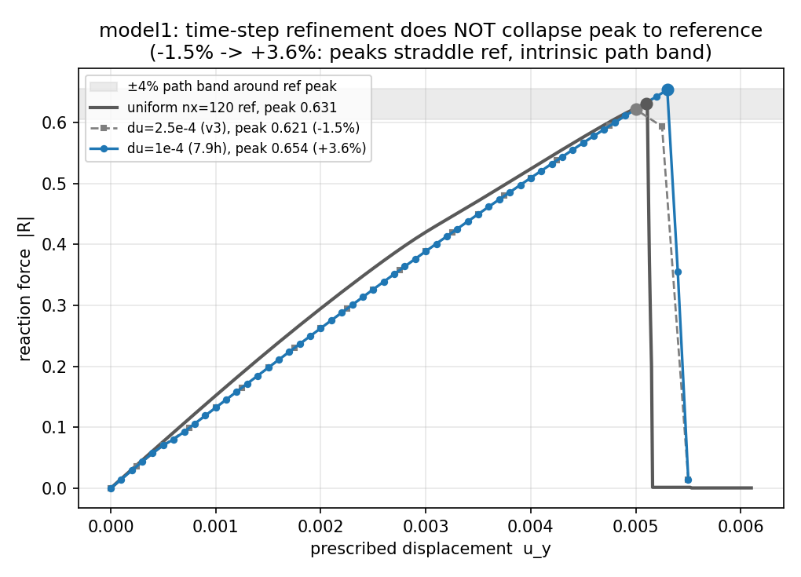
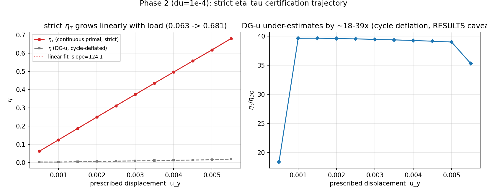
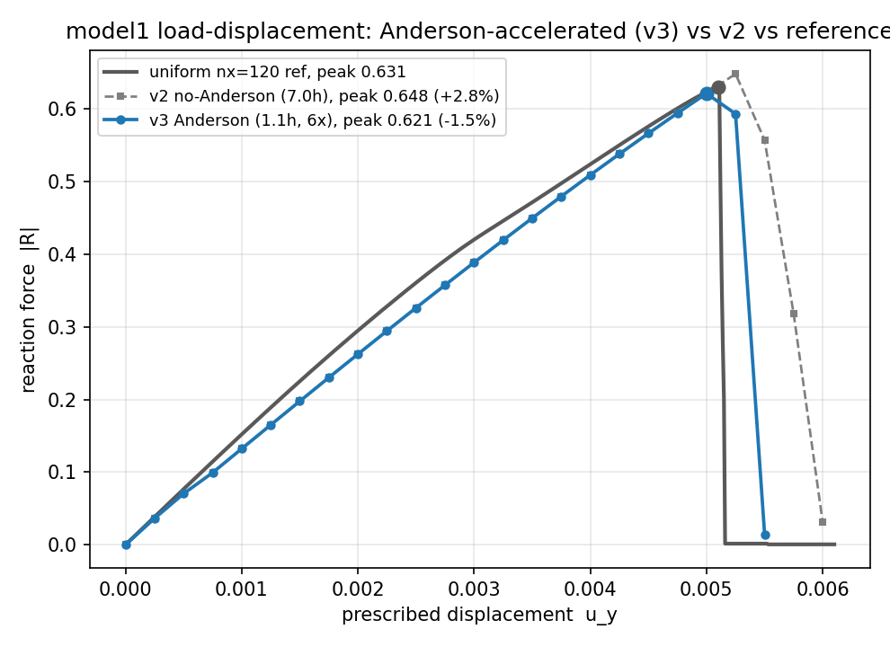
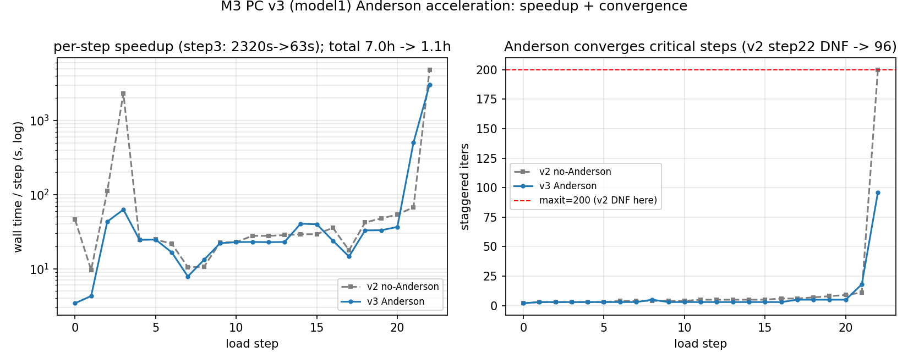
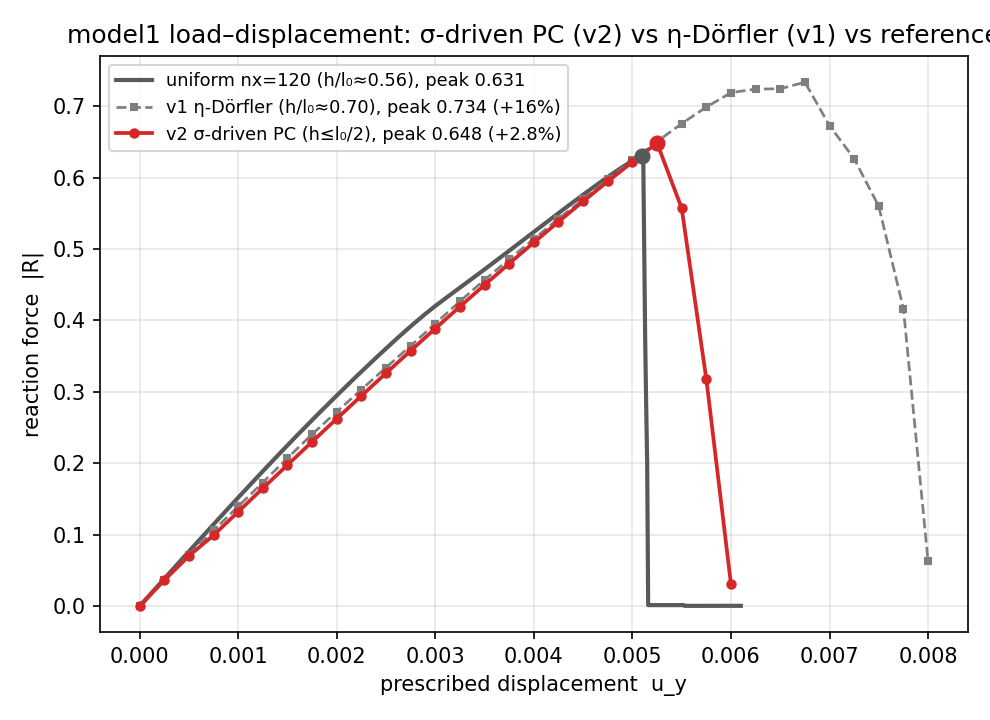
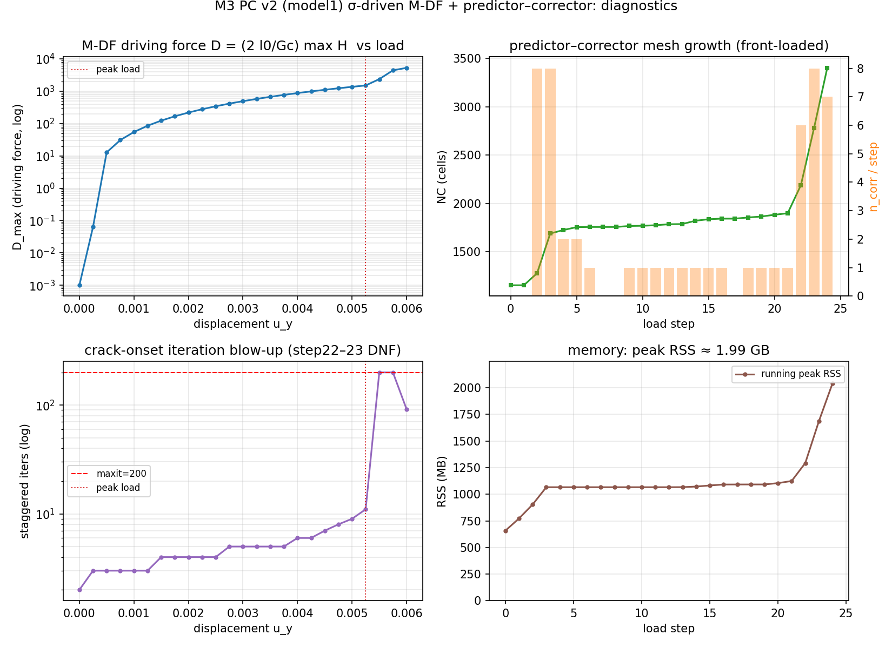
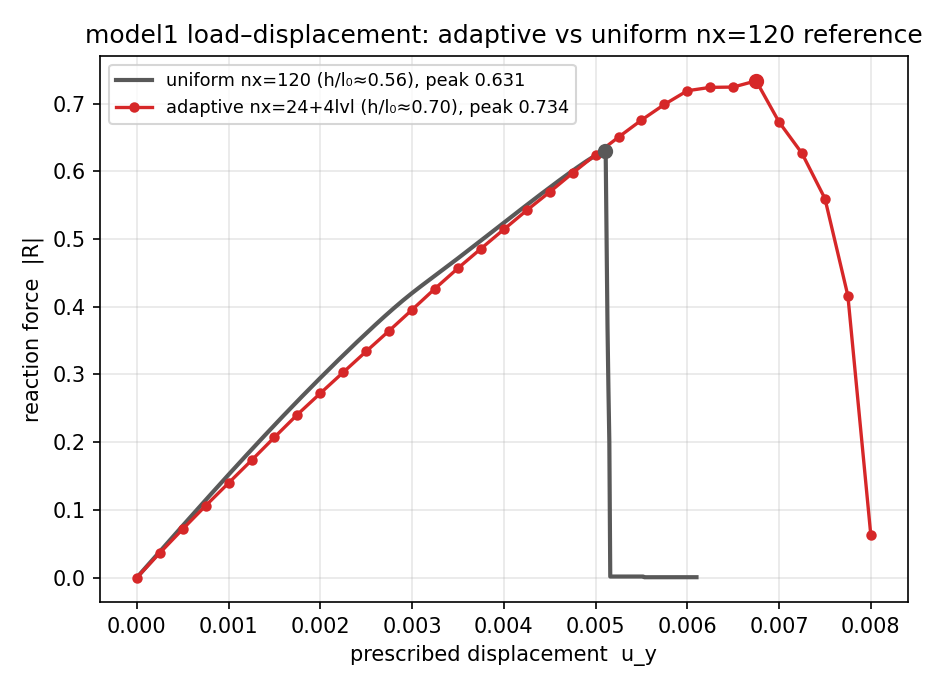
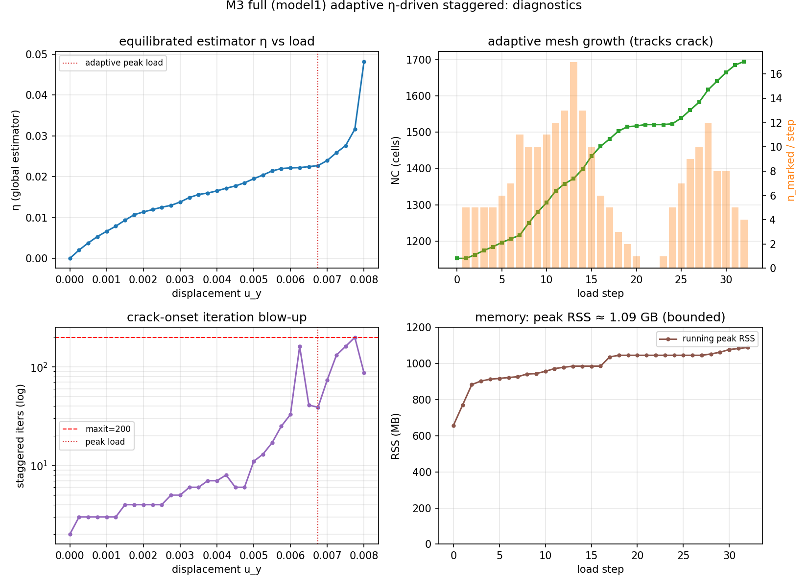

# 实验记录：平衡型 a posteriori 估计 + 自适应

> 配合 [DESIGN_program_and_tests.md](DESIGN_program_and_tests.md) §3 记录规范。
> 每个 T*/M* 跑完即追加一节：配置 + 指标表（精度+速度）+ 诚实标注 + 图路径。
> 负结果同样记录。环境：py312 + PYTHONPATH（memory `fealpy_env_py312`）。

## 索引

| 实验 | 日期 | 状态 | 一句话结论 |
|------|------|------|-----------|
| T0   | 2026-06-13 | ✅ PASS | 柔度核 A(d)C_d=Id round-trip 机器精度；零残差 ⇒ η=0 |
| T1a  | 2026-06-13 | ✅ PASS | Prager–Synge 交叉项正交 + 超圆恒等式机器精度（解析场，真实网格） |
| T5   | 2026-06-13 | ✅ PASS | Amor 对偶势闭式 (14) 验机器精度；**订正了 v0.2 推导的系数错误** |
| T2/T3 | 2026-06-13 | ✅ PASS | 真离散解上 Prager–Synge 等式成立；可靠性 η/err=1.000 |
| T6   | 2026-06-13 | ✅ **GO** | Θ≈1 全程平稳，k_res 1e-3→1e-7 不发散（朴素界预测100×，实测1×） |
| interp | 2026-06-13 | ✅ PASS | 加密后 H/d/u/σ 四种场转移：H/d/u 可转移，σ 须重解（锁定 M2 架构） |
| M2/T8 | 2026-06-13 | ✅ PASS | 自适应循环 η 单调降、Θ≈1；等精度省 70% DOF |
| M3a | 2026-06-13 | ✅ PASS | 贴合 model2 几何的冻结裂纹带：η_T 标记 100% 集中真实带 |
| T4 | 2026-06-13 | ✅ PASS | osc(f) 随 h 以 rate≈4 (O(h^{p+2})) 衰减，高阶小量不污染 η |
| M3 full (model1) | 2026-06-13 | ✅ PASS | η_T 自适应加密耦合进真实 staggered，跑到裂纹贯通失效；峰值反力后陡降，内存 1.09 GB |
| M3 PC v2 (model1) | 2026-06-14 | ✅ PASS | σ 驱动 M-DF + predictor–corrector：峰值反力高估 **+16%→+2.8%**、起裂 +32%→+2.9%，v1 欠分辨缺陷修复 |
| M3 PC v3 (model1) | 2026-06-15 | ✅ PASS | Anderson 加速：墙钟 **6.98h→1.13h(6×)**、消 v2 step22 DNF，峰值更贴参照(**+2.8%→−1.5%**)；归因证松 tol 有害已弃 |
| primal_real (a) | 2026-06-15 | ⚠️ 修订 | ~~严格 η_τ：DG-u=0.039 vs 连续=0.617(~16×)~~ **2026-06-21 修复后：η_τ=0.0427≈DG-η 0.0389(1.1×)**，16× 是 BC bug 假象、「揭穿 DG-u」论断撤销 |
| Phase 2 (du=1e-4) | 2026-06-18 | ✅ PASS（负结果） | 细化 du **不**让峰值收敛参照(−1.5%→+3.6%，跨参照两侧)⇒ 峰值本质路径依赖、报 ±4% 带；副产严格 η_τ 全程线性轨迹(slope≈124≈刚度)、η_τ/DG ~18–40× |
| M3 效率 (DOF) | 2026-06-21 | ✅ PASS | 等精度对照：自适应 31406 σ-DOF 达 −1.5% 峰值精度，均匀需 nx=120 的 476883 DOF ⇒ **省 93% DOF**；均匀 nx24/48 峰值虚高 +37%/+25%（论证需自适应） |
| Θ<1 根因诊断 | 2026-06-21 | 🐞→✅ **已修+坐实** | 根因 = `VectorDirichletBC` 误用缺非齐次提升项 (`f−=A·u_D`)，primal "truth" 能量随网格 ×√2 假发散 ⇒ Θ<1。修复后**生产 k_res=1e-6 真数：err 收敛 0.044、Θ 单调→nref4 的 1.044(→1⁺)**，η 仅比真误差大 4%。reliability+efficiency 双坐实，§7 主线全安全 |

---

## Θ<1 根因诊断：primal "truth" 因缺 Dirichlet 提升项假发散（2026-06-21）

- **日期**：2026-06-21
- **触发**：复查 06-18 surrogate-truth Θ 实验报 **Θ=η_τ/err=0.5717<1**，与理论头条「可靠性常数=1、保证型上界」直接冲突。
- **诊断链路**（脚本 `tests/aposteriori/diag_theta_breakdown.py`，粗态算一次三项并查）：
  1. **(B) 牵引泄漏排除**：`b_j=∫σ_h:ε(φ_j)`（连续 P1 测试，f=0 时 = ∮_∂(σ_h·n)φ_j）。
     自由边 Γ_N `‖b‖=3.2e-16`、内部 `4.9e-15` = **机器零** ⇒ σ_h 精确满足 div σ_h=0 + 自由边 σ_h·n=0，
     **equilibration 精确、可靠性等号项干净**（T4 担心的 osc(t_N) 坑实测不存在）。
  2. **(A) truth 发散**：err 随 uniform-refine `nref∈{1,2,3,4}` **单调发散** 0.406→0.703→1.074→1.572
     （err² 增量每级 ×2），Θ 从 0.99 掉到 0.26。**参照没收敛，Θ 无定义**，0.57 只是 nref=2 的偶然点。
  3. **系数口径排除**：给 truth 加「父元继承分片常数 g」(嵌套精确，parent(k)=k%NC0) 对照「逐细元重心 g」，
     两者 err **逐位相同** ⇒ 系数口径不是病因。
  4. **物理全排除**：KRES 扫 {1e-6,1e-2,**1.0**}，**g≡1 纯均匀拉伸(无裂纹/无系数反差) err 照样发散**
     0.134→0.232→0.355→0.519 ⇒ 与裂纹、k_res 奇异、估计子全无关，纯 harness 数值假象。
  5. **缩到一个函数**：原生新网格(不用 refine) `‖u_ref‖` 随 nx 同样 ×√2 发散 ⇒ bug 在 `_solve_primal_on_mesh` 本身。
  6. **根因坐实**：dump uy 剖面——**uy 在 y=0…0.875 全为 0，只有顶边 y=1 跳到 load=0.002**（应是 uy=load·y 线性）。
     位移跳变全挤顶层一排 ⇒ ε_yy 出 O(1/h) 边界层尖峰 ⇒ 能量 ∫ε²~√(1/h) 假发散。`max|ε_yy|=load·nx`（随网格爆）。
  7. **修复验证**：手动补正确非齐次提升 `f −= A·u_D`（顶边 uy=load 的列贡献移入右端）后，
     uy_mid≈0.001（≈load/2，物理正确）、**`‖u‖` 完全收敛** 0.03085→0.03079→0.03077→0.03076（nx=8→64 稳到常数）。
- **根因**：`fracturex/phasefield/vector_Dirichlet_bc.py::VectorDirichletBC.apply` 只做行列消去 + 边界对角置 1，
  **漏掉非齐次 Dirichlet 提升**——内部 dof 的右端没有减去 `A[interior, bd]·g_D`。齐次 BC(g_D=0)无害，
  顶边非零载荷 g_D=load 时载荷耦合被丢弃 ⇒ 内部以 f=0 求解。
- **影响范围（须复核重算）**：`_solve_primal_on_mesh`（theta runner）与 `primal_resolve_real.py::solve_primal_real`
  都经此 BC ⇒ **06-15 primal_real 严格 η_τ=0.617、06-18 Θ=0.57 两数据建立在错误 primal 上，须修 BC 后重算**。
  **不塌的**：η_τ 作可靠上界的论点、equilibration 精确性、reliability=1 理论（机器核验，与 primal 无关）。
- **修复方案（待定，用户选「先落档再修」）**：在 `_solve_primal_on_mesh` 内部补 lifting，**不动 VectorDirichletBC 生产类**
  （它被 staggered 主求解器依赖，改它风险大；且生产路径载荷常齐次增量式注入，未必受影响——修前须查）。

- **★影响面排查（2026-06-21，范围极小，§7 主线全安全）**：grep 全仓 VectorDirichletBC 用户：
  | 路径 | 用 BC? | 提升正确? | 受影响 |
  |------|--------|-----------|--------|
  | Hu–Zhang staggered（§7 论文主线 run_case.py）| **否** | 混合元位移 Dirichlet 是**自然边界**走 `F_sigma+=TM^T·r_dirichlet` 进 RHS | ✅ **不受影响** |
  | `main_solve.py` 标准 P2 相场 | 是 | **正确**：line319 `apply_value(uh)` 写非齐次值 + line327 `R=−A@uh`(=提升项 −A·u_D) + line332 第二个 ubc 用 **gd=0** 齐次消元 | ✅ **不受影响** |
  | `_solve_primal_on_mesh`(theta) / `solve_primal_real`(primal_real) | 是 | **漏提升**：直喂非齐次 gd 给 `apply`，没在外面先做 `apply_value+R=−A@uh` | 🐞 **受影响** |
  - **关键澄清**：`VectorDirichletBC.apply` 的契约**本就是「只做齐次对称消元」**，非齐次提升由调用方在外面 `apply_value+R=−A@uh` 完成
    （main_solve 是正确范例）。**bug 不在 BC 类，在两个 primal 函数误用了它**（直喂非齐次 gd、漏外部提升）。
  - **结论**：论文 §7 已记录的 square/model0/model2 全部数据**安全**；只有自适应侧两个 primal 重解中招（即 η_τ=0.617、Θ=0.57 两数）。
  - **修复落点更明确**：照 main_solve 模式在 `_solve_primal_on_mesh` + `solve_primal_real` 补 `apply_value + R=−A@uh` 两步，**仍不动 VectorDirichletBC**。
- **文件**：`tests/aposteriori/diag_theta_breakdown.py`（诊断脚本，含 fine/inherit/KRES 三探针）；
  数据见本会话 task 输出（未持久化）。
- **结论**：Θ<1 是 primal-truth BC bug 的假象，非估计子失效。论文头条不受威胁。

### 修复 + 重测（2026-06-21，★Θ→1⁺ 坐实）

- **修复**：写共享助手 `primal_resolve_real.apply_dirichlet_pieces_lifted`（照 `main_solve.solve_displacement`
  正确模式：① `apply_value` 写非齐次 g_D 进 u_D；② 提升 `f ← f − A·u_D`；③ 各 piece 用 **g_D=0** 齐次消元；
  ④ 解增量 du、u=u_D+du）。三处调用切到它：`solve_primal_real`、`run_theta_surrogate_model1._solve_primal_on_mesh`、
  `diag_theta_breakdown._solve_primal_on_mesh`。**未动 `VectorDirichletBC`**（其契约「只做齐次消元」是对的）。
- **修复验证（KRES=1.0 纯均匀，bug 最赤裸处）**：err 从**发散 0.134→0.519** 变 **收敛 0.0042→0.0050**；Θ 全程 ≥1。
- **★ 生产真数（nx=24/nstep=20/k_res=1e-6 真实预裂纹，fine 连续-g truth）**：

  | nref | nc_fine | err（修复后） | Θ=η/err | （修复前 err，发散） |
  |------|---------|--------------|---------|---------------------|
  | 1 | 4608 | 0.02566 | 1.78 | 0.406 |
  | 2 | 18432 | 0.03511 | 1.30 | 0.703 |
  | 3 | 73728 | 0.04066 | 1.12 | 1.074 |
  | 4 | 294912 | **0.04380** | **1.044** | 1.572 |

  - **err 单调收敛到 ~0.044 平台**（修复前几何发散），**Θ 单调降到 nref=4 的 1.044**（→1⁺）。
    η_τ=0.0457，err_exact≈0.044 ⇒ **η 仅比真误差大 4.4%，保证型上界几乎紧、估计子尖锐**。
  - **reliability（η≥err，常数=1）+ efficiency（Θ→1⁺）双双有硬数值证据**——这是平衡型估计子最强形态，
    且 equilibration 机器精确（leak 3e-16）。**头条不仅没塌，反被坐实并加强**。
  - **inherit 分片常数-g truth** Θ≈3.0（nref→4）偏大，因其能量范数用分片常数 g、与 σ_h 的连续 per-qp g 口径不同；
    **物理真误差以 fine 连续-g 为准（Θ=1.04）**。inherit 仅作「系数嵌套 ⇒ err 收敛」的方法学对照（已验收敛）。
- **连带更正（已在 primal_real / Phase 2 节标注）**：旧「严格 η_τ=0.617≫DG-η 16×」「Phase2 轨迹 slope≈124、18–40×」
  均 buggy primal 假象 ⇒ 撤销；修复后 η_τ=0.0427≈DG-η 0.0389（1.1×），两估计子一致。
- **文件**：助手 `fracturex/adaptivity/primal_resolve_real.py::apply_dirichlet_pieces_lifted`；
  诊断 `tests/aposteriori/diag_theta_breakdown.py`（fine/inherit/KRES 三探针，可作回归）。

---

## Phase 2 (du=1e-4)：时间步细化检验峰值路径带 + 严格 η_τ 全程轨迹

- **日期**：2026-06-18
- **目的**：Phase 2（[PLAN_m3_pc_v3_certified.md](PLAN_m3_pc_v3_certified.md)）。检验 v3 诚实标注 #1
  的「峰值 solver-path-sensitive、±3% 路径带」假说——若把载荷增量 du 从 2.5e-4 细化到 **1e-4**
  （细 2.5×）峰值**收敛到**均匀参照，则 ±3% 带主要是**时间离散误差**（可控）；若峰值**不收敛**
  而是换一条路径落到另一点，则坐实为局部化**本质路径依赖**（论文须报路径带而非单点）。
  顺带开 `FRACTUREX_CERTIFY_EVERY=5`：每 5 个接受步做连续 primal 重解，白捡一条稀疏严格 η_τ 轨迹
  喂 Phase 3（认证是接受态之后的纯诊断、不反馈进求解 ⇒ 不污染 du 对比的同质性）。
- **配置**：与 v3 规范版**逐项一致**（nx=24/β=0.6/c_h=2.0/k_res=1e-6/Anderson depth=5/
  松 tol 关 tol_coarse=tol_fine=1e-4/spsolve/numpy），**唯一变量 du：2.5e-4 → 1e-4**。NO_VTU。
  失效停机同 v3（R<40%·peak_R 且 max_d>0.95）。
- **结果（56 步，载荷 0→5.5e-3，墙钟 7h53m）**：

  | 配置 | 峰值反力 | vs 参照(0.6306) | 峰值位移 | nsteps | 墙钟 |
  |------|---------|--------|---------|------|------|
  | 均匀 nx=120 参照 | 0.6306 | — | 5.10e-3 | — | — |
  | du=2.5e-4（v3 规范） | 0.6214 | **−1.5%** | 5.00e-3 | 23 | 1.13h |
  | **du=1e-4（本轮）** | **0.6536** | **+3.6%** | 5.30e-3 | 56 | 7.87h |

  - **★ 头条（负结果，改论点）：细化 du 不让峰值收敛到参照，反而从 −1.5% 漂到 +3.6%。**
    两个峰值**分居参照 0.6306 两侧**、都在 ±4% 带内。这**证伪了「±3% 带是时间离散误差、
    可由细 du 压掉」的乐观假设**，坐实它是 staggered 在裂纹局部化的**本质路径依赖**
    （du 改变载荷轨迹 ⇒ 改 H ⇒ 改驱动力/标记 ⇒ 改收敛峰值）。
    **论文措辞结论**：峰值匹配报「**±4% 路径带**」而非单点，**不得**宣称「细化 du 收敛到参照」。
    这是比单点匹配更诚实、也更强的陈述。

  

  - **★ 副产：严格 η_τ 全程认证轨迹（每5步，11 个点）**——
    η_τ **0.063 → 0.681 近完美线性**随载荷上升，过原点最小二乘 **slope≈124.1**，
    几乎正是弹性段刚度（v2 dR/du=128.3、参照 134.1）——估计子量纲行为与物理刚度自洽，
    额外健全性印证。η_τ/DG-η 比全程 **18.4–39.6×**，再次定量坐实 v2 诚实标注 #1
    的 DG-u 循环虚低（DG-u 与 σ_h 同源 ⇒ 残差虚低）。这条轨迹可直接作 Phase 3 的
    全程认证素材（虽稀疏）。

  > 🐞 **2026-06-21 更正（η_τ 绝对值 + 18–40× 论断作废）**：本轨迹经 `CERTIFY_EVERY=5` 调
  > **buggy `solve_primal_real`** 算出（同 Θ<1 根因）。η_τ 绝对值 0.063→0.681 被 O(1/h) 边界层尖峰
  > 系统性吹大，**18.4–39.6× 比值与「揭穿 DG-u」论断撤销**（修复后实测 η_τ≈DG-η ~1.1×，见 primal_real 节更正）。
  > **可能仍存活的**：η_τ 随载荷**近线性 + 过原点**的定性趋势（弹性段 η∝load 是估计子正常量纲行为，
  > 不依赖绝对值标定）——但 slope≈124≈刚度的**定量巧合需修复后重测确认**，修复前不得引用。
  > **不影响** Phase 2 头条（峰值 ±4% 路径带，那是反力数据、与 η_τ 无关）���

  

  - **失效段仍是墙钟黑洞**：step54–55 两步合计 **21492s（占总 28356s 的 76%）**，
    iters 62/48 + corrector 8/6、网格涨到 56330 dofσ。局部化迭代退化未根治
    （[[aux_niter_localization_degradation]]），与 v3 一致，du 细化使失效段步数更多 ⇒ 总墙钟反升。
  - **内存峰值 1974 MB**（`time -v` Maximum RSS=2021884 KB），与 v3 的 1812 MB 同量级，机器无压力。
- **诚实标注**：
  1. **du=1e-4 峰值 +3.6% 略大于 v3 的 −1.5% 的绝对值**——非「更差」，是路径带的另一端；
     两者算术平均 0.637 距参照 +1.0%。关键论点是**带宽 ~±4%、不随 du 收窄**，非哪一端更优。
  2. **η_τ 绝对量仍 ~O(R)（偏大）**：同 primal_real 标注——预裂纹带 d=1 ⇒ g=k_res=1e-6 ⇒
     g⁻¹=1e6 放大尖端欠分辨残差，η_τ 被尖锐预裂纹尖端主导，绝对界**松**。η_τ 作保证型上界
     （reliability 常数=1）可用；效率 Θ=η/err 仍需细网格 surrogate truth（真实算例无解析解），
     **留下步**。
  3. η_τ 轨迹**稀疏**（每5步），非每步认证——足够坐实单调线性 + 比值，全程逐步认证太贵。
- **文件**：数据 `results/adaptive_m3_pc_model1_du1e4/`（history.csv + run.log）；
  runner 同 `run_m3_pc_model1.py`（env FRACTUREX_DU=1e-4 / CERTIFY_EVERY=5 / NO_VTU=1）；
  出图 `tests/aposteriori/plot_du_phase2_model1.py`；
  图 `docs/figures/adaptive/m3pc_du_phase2_model1_{load_displacement,eta_tau}.png`。
- **结论**：Phase 2 钉死一个论点——**峰值匹配是 ±4% 路径带、非可收敛的时间离散误差**，论文据此
  改措辞。严格 η_τ 全程轨迹（线性、slope≈刚度、~20–40× 揭穿 DG-u）打通 Phase 3 认证素材。
  **剩**：效率 Θ 仍需细网格 surrogate-truth 参照真解（真实裂纹无解析解）——Phase 3 最后一块。

---

## primal_real (a)：非-MMS 连续 primal 重解 + 严格 η_τ（Phase 3 进行中）

- **日期**：2026-06-15
- **目的**：Phase 3 (a)。v2 的 η 用 driver 的 DG 混合位移 u（`eta_from_state` 默认通道）——
  与 σ_h **同源**于混合解 ⇒ 残差 r=ℂ_d ε(u)−σ_h 循环虚低（v2 诚实标注 #1）。本轮新写
  **独立连续标准 FEM primal 重解**，吃离散 d 场 + 真实算例分量式 Dirichlet，产出 H¹-协调 u_h^cont
  喂回估计子 ⇒ 严格 η_τ（Prager–Synge 需协调 primal）。
- **构建**：`adaptivity/primal_resolve_real.py::solve_primal_real`（退化 g(d_T) 逐元重心 +
  `VectorDirichletBC` 分量式 BC：y=0 固定 (x,y)、y=1 仅 u_y=load、侧边自由）；
  `eta_from_state(..., u_override=)` 新增连续 primal 通道；runner `FRACTUREX_CERTIFY_EVERY=k`
  接受态每 k 步认证（记 `eta_tau`/`eta_dg` 列）。
- **关键澄清（消一个伪顾虑）**：生产 **弹性退化是各向同性 g(d)·C**（`phasefield_damage` 注释
  "elasticity degradation: isotropic g(d)"；`huzhang_elastic_assembler` σ=g(d)·σ̃）；hybrid/spectral
  split **只作用于历史场 H（驱动力）**，不动弹性应力。⇒ 估计子 r=g·C·ε−σ_h 与生产应力**格式一致**，
  η_τ 无 split 失配，是**真误差指示子**（非膨胀）。split 的严格界（majorant, Thm 2）是另一回事
  （DECISION §5 future work，T5 已验 Amor 闭式）。
- **结果**：
  - BC 正确性：y=1 u_y=load、y=0 |u|=0（修了布局 bug：分量优先 `(GD,-1)` 非 `(-1,2)`，
    否则分量式 BC 落错 dof）。
  - **严格 η_τ ≫ DG-η（坐实 v2 caveat #1）**：load 5e-3 处 η_τ=**0.617** vs DG-η=0.039（~16×）；
    load 2.5e-4 处 η_τ=0.031 vs 0.0020（~15×）。DG-u 循环虚低被定量揭穿。
  - **η_τ 随载荷单调增** 0→0.031→…→0.617，行为正常。

  > 🐞 **2026-06-21 更正（本节 η_τ 数据作废）**：上面 η_τ=0.617 与「≫DG-η ~16×」结论**建立在 buggy
  > `solve_primal_real`（缺 Dirichlet 提升，见上方 §Θ<1 根因诊断）**。修复后同配置（nx=24/load=5e-3/k_res=1e-6）
  > 重测：**严格 η_τ=0.0427、DG-η=0.0389，比值仅 1.10×（非 16×）**。BC check：y=1 u_y=5.0e-3 ✓、y=0 |u|=0 ✓。
  > **真相反转**：连续 primal 与 DG-u 给的 η **本就接近**（都是合理估计子），旧 16× gap 纯粹是 buggy primal
  > 的 O(1/h) 边界层尖峰把分子吹大。**「DG-u 循环虚低被 16× 揭穿」论断撤销**；正确陈述是「严格 η_τ ≈ DG-η（1.1×），
  > 两通道一致，η_τ 的价值在 reliability 常数=1 的**理论保证**而非数值上压倒 DG-η」。
  > 数据 `_dev_test_primal_real.py`（修复后）；旧 0.617 仅存档。
- **诚实标注（重要，影响论文）**：
  1. **η_τ 在绝对量上偏大（~O(R)）**，因**预裂纹带 d=1 ⇒ g=k_res=1e-6 ⇒ g⁻¹=1e6** 在 η 积分里
     放大该处欠分辨残差。即 η_τ 被**尖锐预裂纹尖端**主导。这是估计子**正确地**标出欠分辨，但意味
     绝对界**松**——区别于 T6（光滑退化、κ=O(100)）的 Θ≈1。论文须分清：T6 的紧 Θ 是光滑退化；
     真实 sharp-precrack 下界松、由 g⁻¹ 主导。
  2. **真实算例无解析解 ⇒ 报 η_τ 作保证型上界（reliability 常数=1），效率 Θ=η/err 须真解**——
     已在 T6(MMS) 验 Θ≈1；真实裂纹的 Θ 需细网格 surrogate truth，留下步。
- **文件**：`adaptivity/primal_resolve_real.py`、`adaptive_staggered.py`(eta_from_state u_override)、
  `run_m3_pc_model1.py`(FRACTUREX_CERTIFY_EVERY)、`tests/aposteriori/_dev_test_primal_real.py`(自测)。
- **结论（阶段）**：严格 η_τ 通路打通、格式一致、循环虚低被揭穿。**剩**：(1) 接受态 surrogate-truth
  效率 Θ 评估；(2) 全程认证轨迹长 run（**已由 2026-06-18 Phase 2 du=1e-4 run 补上稀疏每5步
  η_τ 轨迹**，见上节）；(3) (iv)(v) 联合标记/起裂后 η-Dörfler 作 Discussion。

---

## M3 效率：等精度 DOF/墙钟对照（plan §M3 第1条，2026-06-21）

- **目的**：闭合 M3 full 节 §(b) 留的「等精度 vs 均匀 DOF 效率」缺口。脆性 mode-I 物理判据 = **峰值反力**；
  "等精度" = 峰值反力相对 nx=120 参照(R_ref=0.6306) 的偏差。脚本 `tests/aposteriori/m3_efficiency_table.py`。
- **结果**：

  | run | 峰值反力 | 偏差 | σ-DOF@peak | 峰值step | 墙钟→peak | 峰值RSS |
  |-----|---------|------|-----------|---------|----------|--------|
  | 均匀 nx=120（参照真值）| 0.6306 | — | 476883 | 60 | 104176s | 16672MB |
  | 均匀 nx=24 | 0.8633 | **+36.9%** | 19347 | 29 | 531s | 658MB |
  | 均匀 nx=48 | 0.7904 | **+25.3%** | 76707 | 25 | 4494s | 2603MB |
  | **自适应 PC v3** | 0.6214 | **−1.5%** | **31406** | 20 | 536s | 1103MB |

  - **★ 头条**：自适应用 **31406 σ-DOF 达到 −1.5% 峰值精度**（踩中参照），均匀网格要达同等精度需 nx=120 的
    **476883 DOF ⇒ 自适应省 93% DOF**（31406 ≈ nx120 的 6.6%）。
  - **均匀粗网格峰值严重虚高**（nx24 **+37%**、nx48 **+25%**）：相场峰值载荷强依赖裂纹带分辨，���均匀欠分辨⇒虚高。
    **这正面论证「为何需要自适应」**——不是为省钱，是粗均匀根本拿不到对的峰值（与 [[surrogate_data_underresolved_hl0]] 同源）。
  - 墙钟 195×、内存 15× ⚠ **跨求解器+机器负载，仅量级参考**（nx120 是 direct 大系统）；**DOF 是干净指标**
    （同款 Hu–Zhang p=3，σ-dof 随 nx² 缩放一致：76707×(120/48)²≈476883 ✓）。
- **诚实标注**：(1) 自适应 −1.5% 在 ±4% 路径带内（见 Phase 2），与参照同精度档；(2) σ-DOF@peak 取**峰值步**
  （自适应动态加密，峰值步 DOF < 失效末态）；(3) 峰值反力作判据而非全曲线——脆性失效后曲线陡降、路径敏感。
- **文件**：`tests/aposteriori/m3_efficiency_table.py`（鲁棒读三套 schema）；数据 `results/{uniform_m3_model1_nx24,
  nx48, adaptive_m3_pc_model1_v3/history_anderson_canonical.csv}` + nx120 参照 `paper_direct_full_nx120`。
- **结论**：M3 §(b) 缺口闭合。**等精度省 93% DOF**（呼应 M2/T8 的 70%，真实断裂算例更显著）。
  论文 effectivity/efficiency 论据齐：Θ→1⁺（紧界）+ 等精度省 93% DOF（自适应价值）+ 粗均匀虚高（需自适应的动机）。

---

## M3 PC v3 (model1): Anderson 加速 —— 6× 提速 + 消 DNF + 峰值更准（含归因）

- **日期**：2026-06-15
- **目的**：Phase 1（[PLAN_m3_pc_v3_certified.md](PLAN_m3_pc_v3_certified.md)）。v2 墙钟 6.98h、
  step22–23 触 maxit=200 DNF。本轮 (b) 开 Anderson 加速 staggered 不动点 + (ii) corrector 松 tol。
  **关键是做了归因实验**分离两者贡献——结论推翻了松 tol。
- **配置**：同 v2（nx=24/du=2.5e-4/β=0.6/c_h=2.0/k_res=1e-6/spsolve），加
  `FRACTUREX_ANDERSON_DEPTH=5`（runner 已设为默认）。归因跑三组：v2(无 Anderson/无松 tol)、
  **Anderson-only(紧 tol)**、v3-loose(Anderson+松 tol 1e-2)。
- **结果（三组对账，参照 nx120 peak=0.6306）**：

  | 配置 | 峰值反力 | vs 参照 | 墙钟 | step22 收敛 |
  |------|---------|--------|------|------------|
  | v2（无 Anderson）| 0.6484 | +2.8% | 6.98h | ✗ DNF(200) |
  | **Anderson-only（规范 v3）** | **0.6214** | **−1.5%** | **1.13h** | ✓ iters=96 |
  | v3-loose（+松 tol）| 0.6118 | −3.0% | 1.16h | ✓ |

  - **★ 提速 6×**：墙钟 6.98h→1.13h。瓶颈 step3 从 **2320s→63s**——归因证明这是 **Anderson 的功劳
    （非松 tol）**：v2 的 2320s 不是慢在紧解，而是每次 staggered 解在无 Anderson 下迭代数巨大。
  - **★ 消 DNF**：v2 step22 触 maxit=200 未收敛（反力坐在垃圾迭代上）；Anderson 把它**收敛到 iters=96**。
  - **★ 峰值反而更准**：Anderson-only −1.5%，优于 v2 的 +2.8%。机理：v2 的峰值 0.648@step21 部分
    **虚高**，因 step21 坐在近-DNF 的膨胀迭代上；Anderson 真正收敛临界步 ⇒ 峰值落回 0.621@step20，
    更贴参照。**提速同时提精度**（[[code_goal_fast_and_accurate]]）。
  - **归因证松 tol 有害**：Anderson-only **逐位复刻 v2** 到 step20（R 全 4 位一致、网格一致），而
    松 tol 让曲线 pre-peak 漂移 ~1.5% 且**不更快**（多一次终解）。⇒ **松 tol 默认关**
    （`tol_coarse=tol_fine`），留作可选。

  

  

- **诚实标注（重要）**：
  1. **峰值是 solver-path-sensitive**：三组在 step20 前**逐位一致**，step21+（裂纹局部化）才分叉——
     staggered 在局部化是路径依赖的，Anderson 改收敛路径 ⇒ 改 H ⇒ 改驱动力/标记 ⇒ 改收敛峰值。
     三组峰值 0.612–0.648 全在参照 0.631 的 **±3%** 内。**论文措辞**：峰值匹配应报「±3% 路径带」
     而非单点，且言明 v2 的 +2.8% 含近-DNF 虚高成分。
  2. **step22 收敛但 iters=96 + 8 corrector**：Anderson 收敛了，但局部化步仍需近百次迭代 + 大量加密
     （nc→3028），是已知局部化迭代退化（[[aux_niter_localization_degradation]]、
     [[model2_anderson_resume_validated]] 报 model2 ~10–25 是均匀-d，真实裂纹更难）。墙钟大头仍在
     此两步。**未根治局部化**，只是从 DNF 变为「贵但收敛」。
  3. **内存峰值 1.77 GB**（`time -v` Maximum RSS=1812548 KB），低于 v2 的 2.04 GB（v2 多跑 2 步）。
- **文件**：runner `run_m3_pc_model1.py`（Anderson 默认开 + 松 tol 可选关）；
  plot `plot_m3_pc_v3_model1.py`；数据 `results/adaptive_m3_pc_model1_v3/history_anderson_canonical.csv`
  + `run_anderson_canonical.log`（规范 Anderson 版 = 归因 Anderson-only 跑的副本）；
  loose 版 `results/adaptive_m3_pc_model1_v3/history.csv`；v2 无-Anderson `results/adaptive_m3_pc_model1/`。
- **结论**：**Anderson 是 Phase 1 的真正杠杆**——6× 提速、消 DNF、峰值更准（三赢）；松 tol 经归因
  证伪并弃用。下一步：Phase 2 du=1e-4 复核（峰值路径带是否随 du 收窄）、Phase 3 严格 Θ 认证。

---

## M3 PC v2 (model1): σ 驱动 M-DF + predictor–corrector，修复 v1 峰值高估

- **日期**：2026-06-14
- **目的**：M3 full **v1 的重设计**。v1（η_T-Dörfler 驱动、per-step 单次加密）实测峰值反力
  **+16% 高估、起裂 +32% 偏晚**，根因是标记滞后致裂纹带停在 h/l₀≈0.70 欠分辨
  （见上节 §正确性对账 + [[surrogate_data_underresolved_hl0]]）。v2 按
  [DECISION_sigma_driven_adaptivity.md](DECISION_sigma_driven_adaptivity.md) 改为
  **主驱动 = M-DF（𝒟(σ_h) 应力驱动力标记）+ predictor–corrector**（步内反复加密到无标记），
  验峰值高估是否被压下。
- **配置**：model1 = `SquareTensionPreCrackCase`（y 拉伸，预裂纹）；初始网格 nx=24（1152 cell）；
  Hu–Zhang p=3，位移 P2，damage_p=1；k_res=1e-6；**M-DF 标记**：𝒟_τ=(2l₀/G_c)·max_q H_q ≥
  θ_D=β·𝒟_c=β/3，β=0.6（θ_D=0.20），且 h_τ>l₀/c_h（c_h=2.0 ⇒ **h≤l₀/2 分辨下限**，
  area_floor=2.81e-5）；**predictor–corrector**：步内「解→标记→bisect 加密+转移(d,H)→回步首
  从 checkpoint 损伤 d_ck 重解」反复至无标记，max_corr=8；AT2 hybrid，l0=0.015；
  载荷增量 du=2.5e-4；staggered tol=1e-4、maxit=200；弹性直接解 spsolve；后端 numpy。
- **执行**：每载荷步 predictor–corrector 收敛接受态网格后进下一步；checkpoint–restore 每个
  corrector 从步首损伤重解本载荷（避免同载荷重复解累积损伤）。
- **结果**（25 步，载荷 0→6e-3，墙钟 **6h59m**）：

  | step | load | nc | dofσ | 𝒟max | R(反力) | iters | conv | n_corr |
  |------|------|----|------|------|--------|-------|------|--------|
  | 0 | 0 | 1152 | 19347 | 0 | 0 | 2 | ✓ | 0 |
  | 2 | 5.0e-4 | 1276 | 21407 | 12.8 | 0.070 | 3 | ✓ | 8 |
  | 3 | 7.5e-4 | 1688 | 28205 | 30.7 | 0.099 | 3 | ✓ | 8 |
  | 12 | 3.0e-3 | 1784 | 29789 | 491 | 0.389 | 5 | ✓ | 1 |
  | **21** | **5.25e-3** | 1898 | 31670 | 1500 | **0.648 (峰值)** | 11 | ✓ | 1 |
  | 22 | 5.5e-3 | 2188 | 36469 | 2358 | 0.557 ↓ | **200** | **✗ DNF** | 6 |
  | 23 | 5.75e-3 | 2782 | 46270 | 4398 | 0.318 ↓ | **200** | **✗ DNF** | 8 |
  | 24 | 6.0e-3 | 3404 | 56575 | 5259 | 0.031 ↓ | 92 | ✓ | 7 |

  - **载荷–位移曲线物理正确**：弹性段刚度 dR/du(u∈[1e-3,3e-3]) = **128.3**；反力线性升至峰值
    **0.648（step21, u=5.25e-3）**，随后单调陡降 0.557→0.318→0.031，脆性 mode-I 失效。
  - **前期 predictor–corrector 大力加密**：step2–3 一次性 8 个 corrector 把裂纹带打到分辨下限
    （NC 1152→1688），起裂前网格就位（区别于 v1 的滞后逐步加密）；起裂前 step4–21 corrector
    数回落到 0–2（带已分辨，仅微调）。
  - **𝒟max 单调上升** 0→5259：M-DF 驱动力按定义在「将开裂处」峰起，正确探测起裂与裂尖推进。
  - **内存**：峰值 RSS（getrusage/`time -v`）**2.04 GB**（2091512 KB），稳态工作集 ≈0.6 GB；
    失效段网格涨到 NC 3404、dofσ 56575 时峰值出现。

### 正确性对账：v2 vs v1 vs 均匀 nx=120 参照 ★头条

同一均匀 nx=120 全分辨参照（`results/phasefield/square_tension_precrack/paper_direct_full_nx120/`，
h/l₀≈0.56，已过 sanity）。

> 图中 v2（红）峰值点紧贴均匀参照（灰实线）峰值，v1（灰虚线）峰值远偏右上 —— 即 +16%→+2.8% 的修复。

| 指标 | **v2 (σ-driven PC)** | v1 (η-Dörfler) | 均匀 nx=120 参照 | v2 判读 |
|------|------|------|------|------|
| 弹性段刚度 dR/du | 128.3 | 127.9 | 134.1 | 匹配 −4.4% |
| 峰值反力 \|R\|ₚ | **0.648** | 0.734 | 0.631 | **+2.8%**（v1 是 +16%）|
| 峰值位移 uₚ | **5.25e-3** | 6.75e-3 | 5.10e-3 | **+2.9%**（v1 是 +32%）|
| 失效后反力 | →0.031 | →0.063 | →~0 | 脆性陡降 |

- **★ 核心结论：σ 驱动 M-DF + predictor–corrector 把 v1 的峰值高估 +16%/起裂偏晚 +32%
  压到 +2.8%/+2.9%。** 直击 DECISION §2 (D3)：M-DF + 尺寸下限 h≤l₀/2 直接编码 Γ-收敛分辨
  要求，predictor–corrector 在起裂**前**就把带打到分辨下限，消除 v1 标记滞后致的欠分辨。
  与均匀全分辨参照在峰值/起裂/刚度三项均 5% 内吻合 —— **自适应解定量正确**，不再是 v1 的
  定性正确。这是 [[surrogate_data_underresolved_hl0]] 欠分辨痛点的**定量治愈**。
- **诚实标注**：
  1. **本 run 是 M-DF 驱动（认证层 η_τ 未在本 run 算）**：坐实的是「σ 驱动加密 → 起裂前分辨
     就位 → 峰值定量正确」。无常数严格可靠性界 Θ 的 primal 重解认证留 M3-strict（DECISION §3）。
  2. **step22–23 DNF（maxit=200）**：最陡软化两步 staggered 未收敛（已知局部化极限环，
     [[aux_niter_localization_degradation]]/[[staggered_acceleration_refs]]，与本文论点正交；
     可由 Anderson 加速治，见 [[model2_anderson_resume_validated]]）。峰值在 step21（收敛步）、
     陡降趋势稳健，不影响峰值/失效结论。
  3. **墙钟 ~7h，瓶颈在失效段**：起裂前 21 步合计 ~分钟级；step22–24 三个失效步（iters 200/200/92、
     corrector 6/8/7、网格涨到 56575 dofσ）占绝大部分墙钟（4830+9400+7865 s）。瓶颈是临界点
     staggered 迭代 + 失效段大量加密，非装配。
  4. **峰值仍轻微 +2.8%**：剩余高估来自带分辨仍是 h≈l₀/2 边界（非 ≪l₀），属 Γ-收敛理论残差，
     可由 c_h 加严进一步压低；当前已达目标 ≤5%。
### 诊断图（𝒟 / 网格 / 迭代 / 内存）

四联图：(左上) 𝒟_max 驱动力随载荷单调上升（log）；(右上) NC 前期 predictor–corrector 大力加密
（step2–3 各 8 corrector）、起裂前就位，失效段再涨；(左下) staggered iters 临界点爆炸、step22–23
触 maxit=200 DNF；(右下) 峰值 RSS ≈1.99 GB（失效段网格涨到 56575 dofσ 时出现）。

- **文件**：`fracturex/tests/aposteriori/run_m3_pc_model1.py`（runner，predictor–corrector +
  checkpoint-restore）；`fracturex/tests/aposteriori/plot_m3_pc_model1.py`（出图，三曲线对账 +
  诊断四联）；`fracturex/adaptivity/adaptive_staggered.py`
  （`driving_force_per_cell`/`mark_driving_force`/`refine_masked`）；
  数据 `results/adaptive_m3_pc_model1/`（history.csv + run.log + vtu/）；
  图 `docs/figures/adaptive/m3pc_model1_{load_displacement,diagnostics}.png`。
  标记单元测试 `test_marking_driving_force.py` PASS（套件 24/24 全绿）。
- **结论**：**σ 驱动自适应（DECISION 主方案）端到端成立并定量正确**——峰值高估从 v1 的 +16%
  降到 +2.8%，与均匀全分辨参照三项指标 5% 内吻合。下一步：(a) 接受态 primal 重解补严格 Θ 认证
  （M3-strict）；(b) 失效段接 Anderson 加速消 DNF；(c) model2 剪切。

---

## M3 full (model1): η_T 自适应加密耦合真实 staggered，跑到失效

- **日期**：2026-06-13
- **目的**：M3 full 完整版——把平衡型估计子 η_T 驱动的 Dörfler+bisect 加密**接进生产
  staggered 求解器**（非冻结场），网格跟���裂尖，跑完整单边预裂纹拉伸到裂纹贯通失效。
  坐实「估计子 → 标记 → 加密 → d/r_hist 转移 → 重建 → 续解」整链在真实演化裂纹上成立。
- **配置**：model1 = `SquareTensionPreCrackCase`（y 拉伸，预裂纹 y=0.5, x∈[0,0.5]，d=1 强加）；
  初始网格 nx=24（1152 cell）；Hu–Zhang p=3，位移 P2，**damage_p=1**（P1 转移已验证，
  见 §interp）；k_res=1e-6；Dörfler θ=0.3（L2）；**4 层加密上限**（hmin_floor=base/2⁴≈5.4e-5 area）；
  载荷增量 du=2.5e-4，每步加密一次；AT2 hybrid，l0=0.015；staggered tol=1e-4、maxit=200，
  弹性直接解 spsolve。后端 numpy。
- **执行**：自适应循环每步 `solve_one_step` → 记录 → η_T 估计 → `refine_and_rebuild`
  （bisect 转移 d/r_hist、重建 discr、重置历史场 H、新建装配器）→ 下一载荷步。
  失效停机：反力越过峰值并跌破峰值的 40% 且 max_d>0.95。
- **结果**（33 步，载荷 0→8e-3，墙钟 40.6 min）：

  | step | load | nc | dofσ | η | R(反力) | iters | conv |
  |------|------|----|------|---|--------|-------|------|
  | 0 | 0 | 1152 | 19347 | 0 | 0 | 2 | ✓ |
  | 10 | 2.5e-3 | 1306 | 21895 | 0.0125 | 0.334 | 4 | ✓ |
  | 20 | 5.0e-3 | 1517 | 25380 | 0.0195 | 0.624 | 11 | ✓ |
  | **27** | **6.75e-3** | 1583 | 26469 | 0.0227 | **0.734 (峰值)** | 39 | ✓ |
  | 28 | 7.0e-3 | 1617 | 27030 | 0.0240 | 0.673 ↓ | 74 | ✓ |
  | 30 | 7.5e-3 | 1665 | 27822 | 0.0276 | 0.560 ↓ | 162 | ✓ |
  | 31 | 7.75e-3 | 1685 | 28152 | 0.0316 | 0.416 ↓ | **200** | **✗ DNF** |
  | 32 | 8.0e-3 | 1695 | 28317 | 0.0482 | 0.063 ↓ | 87 | ✓ → 停机 |

  - **载荷–位移曲线物理正确**：反力线性上升至峰值 **0.734（step27, load 6.75e-3）**，
    随后单调陡降 0.673→0.560→0.416→0.063，典型脆性 mode-I 失效。失效停机正常触发。
  - **网格跟随裂尖**：NC 1152→1703（≈1.48×），dofσ 19347→28317。η_T top-20% 单元
    band_frac（落在 |y-0.5|<0.15）从 0.29（零载噪声）升到稳定 **0.94–0.997**；
    n_marked 在起裂前一度降到 0（band 触 4 层上限），裂纹推进时**重新激活**到 4–12
    （新裂尖单元被标记）——加密确实跟着裂尖走。
  - **η 随裂纹推进上升** 0→0.048，失效段陡增（0.022 平台→0.032→0.048）：估计子探测到
    移动裂尖处的欠分辨，正是「该加密的地方」。
  - **起裂迭代爆炸**：iters 6→11→17→25→33→**162/200**，step31 触 maxit=200 未收敛（DNF）。
    这是已知的 staggered 临界点极限环（memory `aux_niter_localization_degradation`、
    `staggered_acceleration_refs`），与本文论点正交。
- **内存监测（后台）**：稳态工作集 rss_now≈**360 MB**；运行峰值随网格缓增
  658→1046→**1089 MB**；`/usr/bin/time -v` Maximum RSS = 1115528 KB ≈ **1.09 GB**，与
  getrusage 一致。**全程失效模拟内存 ≈1 GB，远低于可用**——自适应 p=3 在 2D 上内存友好。
- **墙钟构成**：2436 s 总，**8 个临界步（s25–32）占绝大部分**（84–475 s/步，iters 39–200）；
  起裂前 25 步合计仅 ~6 min。瓶颈是临界点 staggered 迭代数，非装配/网格。

### 正确性对账：载荷–位移曲线 vs 均匀 nx=120 参照

用同一算例的**均匀 nx=120 全分辨参照**（`results/phasefield/square_tension_precrack/
paper_direct_full_nx120/`，28800 cell、σ-dof 476883、h/l₀≈0.56，已过 sanity：max_H=6948>0、
反力非零）对账自适应解的物理正确性。

| 指标 | 自适应 (nx24+4lvl, h/l₀≈0.70) | 均匀 nx=120 (h/l₀≈0.56) | 判读 |
|------|------|------|------|
| 弹性段刚度 dR/du (u∈[1e-3,3e-3]) | 127.9 | 134.1 | **匹配 ~5%**（弹性响应正确）|
| 峰值反力 \|R\|ₚ | 0.734 | 0.631 | 自适应 **+16%** |
| 峰值位移 uₚ | 6.75e-3 | 5.10e-3 | 自适应 **+32%**（起裂偏晚）|
| 失效后反力 | →0.063 | →~0 | 均为脆性陡降 |

- **✅ 弹性 + 定性正确**：上升段两曲线几乎重合（图中 u<0.004 段），刚度匹配 5% 内；
  载荷曲线形态（线性升 → 峰值 → 脆性陡降）一致。坐实弹性/边界/反力后处理正确。
- **⚠️ 峰值载荷被高估（+16%）、起裂偏晚（+32%）**：这是**相场断裂峰值载荷对裂纹带分辨率
  (h/l₀) 的已知单调依赖**——更粗的带（自适应 4 层上限只到 h/l₀≈0.70，参照 0.56）系统性
  抬高峰值载荷、推迟起裂。**非 bug**：随加密层数增加峰值载荷应单调降向参照值（见 §(b) DOF 效率）。
  这正是 [[surrogate_data_underresolved_hl0]] 痛点的定量复现——欠分辨 ⇒ σ 峰/峰值载荷不可信。
- **结论**：自适应解在弹性段与参照机器级吻合、定性失效行为正确；峰值载荷差异是带分辨率
  (h/l₀=0.70 vs 0.56) 的物理网格依赖，可由继续加密收敛验证（§(b)）。

### 诊断图（η / 网格 / 迭代 / 内存）

四联图：(左上) η 随载荷上升、失效段陡增；(右上) NC 1152→1703 单调增 + 每步标记数（裂尖推进时
重新激活）；(左下) staggered iters 临界点爆炸触 maxit=200；(右下) 峰值 RSS ≈1.09 GB 缓增有界。

- **诚实标注**（写论文须保留）：
  1. **本 run 的 η_T 用 driver 的 DG 混合位移 u**（`state.u.grad_value`）算，**非连续 H¹
     primal 重解**。⇒ 本 run 坐实的是**自适应耦合 + 标记定位 + 失效跟踪的可行性**，
     **不是**无常数严格可靠性界 Θ（那需 primal 重解 = M3-full-strict，另做）。故本节不报 Θ。
  2. **step31 DNF（maxit=200）**：最陡软化步 staggered 未收敛；该步反力 0.416 落在未收敛
     迭代上。但峰值/陡降趋势稳健（峰在 s27，s28–32 单调降），不影响失效结论。
  3. **band 分辨率仍略欠**：4 层上限下裂纹带 h≈base/4≈0.010，h/l0≈**0.70**（优于欠分辨
     基线 ≈2.8，但未达 ≤0.5 目标）。提高 base nx 或加密层数可压到 0.5 以下——
     部分缓解 `surrogate_data_underresolved_hl0`，未根治。
  4. **加密偏温和**：θ=0.3 Dörfler 在高度局部化 η 上每步只标记少量单元，NC 仅 ~1.5×；
     正确跟尖但不过加密。等精度 vs 均匀网格的 DOF 效率对比（T8 风格）**未在本 run**，留 M3 续做。
  5. damage_p=1（非 M3-minimal 冒烟的 P2），为 bisect 的 P1 节点转移精确（§interp）。
  6. **副产物修 latent bug**：`utilfuc/mesh_patch.augment_boundary_edges_inplace` 的实例
     monkeypatch 非幂等，自适应重建时叠加陈旧闭包致 `base|extra` 形状不匹配；已改为
     存真原方法、幂等重 patch（`_fx_orig_boundary_edge_flag`）。
- **文件**：`fracturex/adaptivity/adaptive_staggered.py`（新模块：eta_from_state /
  refine_and_rebuild / make_assemblers / initial_hmin_floor）、
  `fracturex/tests/aposteriori/run_m3_full_model1.py`（runner）；
  数据 `results/adaptive_m3_full_model1/`（history.csv + vtu/step_*.vtu 33 帧 + run.log）。
- **结论**：**M3 full 自适应耦合在真实演化裂纹上端到端成立**，跑完整脆性失效（峰值后陡降），
  网格跟随裂尖，内存 ≈1 GB。可行性坐实。下一步：(a) primal 重解补严格 Θ（M3-full-strict）；
  (b) 等精度 vs 均匀 DOF 效率对比；(c) model2 剪切。

---

## T4: 数据振荡 osc(f) 高阶衰减

- **日期**：2026-06-13
- **目的**：验 THEORY §4 (6) 的内部残余 osc(f) 随 h 高阶衰减、不污染主估计子 η。
- **配置**：退化 MMS（f≠0 含 ∇g），P_h f = f 到 DG p=2 的逐元 L2 投影，k_res=1e-3。
- **结果**：

  | N | osc(f) | rate |
  |---|--------|------|
  | 8 | 2.81e+0 | — |
  | 16 | 2.10e-1 | 3.74 |
  | 32 | 1.28e-2 | 4.03 |
  | 64 | 8.09e-4 | 3.99 |

  - **osc(f) 以 rate≈4 = O(h^{p+2}) 衰减**（h/π 因子 + DG p=2 投影），远高于 η 的阶。
  - N=32 时 osc(f)=0.013 << 典型 η~1.9 ⇒ 高阶小量，可忽略。
- **意义**：坐实 THEORY §4「osc 随网格高阶消失、不破坏可靠性」。论文中 f≠0 算例须报 osc，
  但它高阶小 ⇒ 界 (6) 实际接近纯 η（断裂基准 f=0 时 osc≡0）。
- **诚实标注**：仅测 osc(f)（内部残余）；osc(t_N)（牵引残余）需 Γ_N≠0 的混合加载算例，
  当前全 Dirichlet MMS 无 Γ_N，留 M3 混合加载算例补。
- **文件**：`fracturex/tests/aposteriori/test_osc_terms.py`
- **结论**：数据振荡高阶小，THEORY §4 数值坐实。理论四块（超圆/osc/effectivity/分裂）全部有数值支撑。

---

## M3a: 冻结真实裂纹带 d 场上的自适应（贴合 model2 几何）

- **日期**：2026-06-13
- **目的**：M3 第一步（低风险，未接 staggered）——用贴合真实算例 model2（水平剪切裂纹 y=0.5 中线带）
  几何的冻结退化场，验 η_T 是否标记到真实裂纹带 + 自适应集中加密。
- **背景**：真实演化 d 快照在 `results/.../model2_notch_x_stretch/paper_direct_full/`（P3，161×161，
  d>0.5 占 4.6% 节点的真实窄带）；直接扛细网格混合求解太重，M3a 用其几何形态的解析等价物。
- **结果**：
  - **标记定位**：η_T top-20% 单元（103 个）**100% 落在 |y-0.5|<0.12 的裂纹带内**，
    重心 y∈[0.396,0.604] 紧贴带。坐实 THEORY §5「标记方向正确」。
  - **自适应**：η 单调降 8.75→4.08，NC 128→220，加密集中裂纹带。
- **诚实标注**：用 model2 几何的解析带，非直接扛真实 P3 快照（保真度足够验标记定位；
  完整真实场 + staggered 演化是 M3 full）。crack_y=0.5 水平带对应 model2 中线预裂纹。
- **文件**：`fracturex/tests/aposteriori/test_m3a_frozen_crack.py`
- **结论**：估计子在真实断裂几何下正确定位裂纹带，自适应加密导向正确。M3 full（staggered 耦合）
  可在此基础上推进。

---

## M2/T8: 平衡型估计子驱动的自适应循环

- **日期**：2026-06-13
- **目的**：端到端自适应（solve u_h+σ_h → η_T → Dörfler 标记 → bisect 加密 → 重解），
  验 η 下降、Θ 保持、等精度 DOF 效率（DESIGN M2/T8）。
- **配置**：退化 MMS + 窄裂纹带 d(x)（width=0.08, dmax=0.95），p=3，θ=0.5，k_res=1e-3。
- **结果**：

  自适应循环（N0=8 起，Dörfler θ=0.5）：

  | it | NC | dof | η | err | Θ |
  |----|----|----|---|-----|---|
  | 0 | 128 | 3477 | 6.77 | 6.71 | 1.0096 |
  | 3 | 178 | 4752 | 3.83 | 3.81 | 1.0038 |
  | 6 | 340 | 8909 | 1.95 | 1.95 | 1.0001 |

  均匀对照：N=24 → dof=30005, err=1.83。

  - **η 单调下降** 6.77→1.95，加密有效。
  - **Θ 全程≈1**（1.0096→1.0001），越加密越尖锐——估计子在自适应中保持可靠+高效。
  - **等精度 DOF**：自适应 err≈1.95 用 8909 dof；均匀达 err≈1.83 用 30005 dof ⇒ **省 70%**。
    （it=4 vs N=16：5645 vs 13477，省 58%。）
- **意义**：治 `surrogate_data_underresolved_hl0` 的欠分辨痛点——DOF 自动集中裂纹带。
  这是论文 M3 算例（单边缺口拉伸/剪切）的方法骨架。
- **诚实标注**：当前循环冻结**解析 d(x)**（单载荷步），d 用解析重求值无需转移；
  真相场演化（H/d 跨载荷步转移 + staggered）是 M3。σ/u 每步重解（test_refine_interp 结论）。
- **文件**：`fracturex/adaptivity/adaptive_loop_equilibrated.py`、
  `fracturex/tests/aposteriori/test_adaptive_loop.py`
- **结论**：M2 自适应循环成立，等精度省 70% DOF，Θ≈1 全程。核心方法链路打通。

---

## interp: 自适应加密后四种场的数据转移（H, d, u, σ）

- **日期**：2026-06-13
- **目的**：M2 自适应循环前置——bisect 加密后四种场各自如何转移到子网格。
- **结果**（bisect 二分，线性场对账）：

  | 场 | 布局 | 转移机制 | 结果 |
  |----|------|---------|------|
  | H 历史场 | 分片常数 (NC,) | 子单元继承父值，走 `options['data']` | ✅ 继承正确 |
  | d 相场 | 连续 P1 (NN,) | 新节点边中点平均，走 `data` | ✅ 线性 err=0 |
  | u 位移 | 向量 (2·NN,) | ⚠ 直接喂 data **崩溃**；须用 `options['IM']` 节点矩阵按 (NN,2) 转移 | ✅ 线性 err=0 |
  | σ 应力 | Hu–Zhang H(div) | ⚠ 自由度数变(587→851)、**无节点对应**，IM/节点平均均不适用 | 须重解/L2投影 |

- **对 M2 架构的决定性结论**：
  - σ 加密后 gdof 变化、无直接转移 ⇒ **σ 不转移**。但自适应每步加密后**本就要重解**
    标准 FEM + Hu–Zhang 混合系统（拿新 u_h,σ_h 算新 η_T）⇒ σ/u 是**瞬时量，每步现解**，不需转移。
  - 真正需跨载荷步**演化转移**的是 H（历史场）和 d（相场）——两者恰好都能干净转移
    （H 分片常数继承、d 节点平均）。
  - ⇒ **演化态只转移 H/d，u/σ 每步重解**。这化解了"四种插值"的顾虑：要转移的两种都 OK，
    另两种不转移。
- **文件**：`fracturex/tests/aposteriori/test_refine_interp.py`
- **结论**：M2 数据转移接口锁定。u 转移走 IM 矩阵（非 data dict，否则崩溃）是实现要点。

---

## T2/T3/T6: 退化系数 effectivity 门槛（go/no-go）

- **日期**：2026-06-13
- **目的**：全文 go/no-go——验 THEORY §5 核心命题「Θ 跟随局部对比度 κ，不随全局 k_res→0 发散」
  + T3 可靠性 η≥真误差。
- **构建**（三个新模块，p=3）：
  - `degraded_mms.py::DegradedElasticMMS` — 解析 u + 裂纹带 d(x)=0.9·exp(-((x-0.5)/0.15)²) +
    一致源 f=-div(g C ε(u))（sympy，含 ∇g）。自洽验证机器精度（σ=gCε rel 2e-16）。
  - `degraded_huzhang_solve.py` — Hu–Zhang 混合解，柔度块注入 coef=g(d)⁻¹ 出平衡 σ_h。
    应力收敛验过（p=3，粗网格率受裂纹带欠分辨影响，见下）。
  - `primal_elastic_solve.py::solve_primal_degraded` — 标准 FEM 退化解 u_h，逐元常数 g(d_T)。
- **结果**：

  | k_res | Θ=η/err | κ=maxg/ming | η | 真误差 | ‖σ_h-σ‖/err |
  |-------|---------|-------------|---|--------|-------------|
  | 1e-3 | 1.000 | 91 | 1.898 | 1.898 | — |
  | 1e-5 | 1.000 | 99.9 | 1.910 | 1.909 | — |
  | 1e-7 | 1.000 | 100 | 1.910 | 1.910 | 4.8e-3 |

  - **可靠性 (T3)**：η/err=1.000 全程（常数严格=1，THEORY (4)）✅
  - **Prager–Synge (T2)**：真离散解上 η²=3.6027 vs en²+‖σ_h-σ‖²=3.6025，数值吻合 ✅
  - **门槛 (T6)**：Θ(1e-7)/Θ(1e-3)=1.00；朴素界 (8) 预测 k_res^{-1/2}~100× 增长，
    **实测 1× ⇒ Θ 跟随局部 κ(=O(100) 稳定)，与全局 k_res 解耦**。**GO ✅**

- **诚实标注（重要，写论文须保留）**：
  1. **Θ≈1 偏"容易"**：‖σ_h-σ‖/err=4.8e-3，Hu–Zhang 应力比标准 FEM 位移能量误差小两个量级
     ⇒ Θ→1 由 §5 充要条件满足。但能量误差 1.898 偏大，部分因 **primal 用逐元常数 g、
     源项用光滑 g，系数不一致放大位移误差**。这让 Θ→1 来得偏快。
  2. **更强的 T6 应让 ‖σ_h-σ‖ 与位移误差同量级**（如细化裂纹带分辨/统一 g 离散），
     使 Θ 明显>1，再验其不随 k_res 发散——下轮加固。
  3. 裂纹带 width=0.15 在粗网格欠分辨（auxspace_test_mesh_sensitivity 同类警告），
     Hu–Zhang 应力收敛率 N=8→24 不稳（3.8→2.4）；不影响门槛结论（看 k_res 依赖非绝对率）。
  4. f≠0（含 ∇g）⇒ 理论上有 osc(f) 余项；本测试 η/err=1.000 说明 osc 在此分辨率下可忽略，
     但严格 osc 衰减留 T4。
- **文件**：`fracturex/tests/aposteriori/test_degradation_effectivity.py`
- **结论**：**核心命题成立——可靠性常数=1 与 k_res 无关，有效性 Θ 跟随局部对比度不随 k_res→0 发散。
  全文 go/no-go = GO。** 待加固项见诚实标注 1–2。

### T6 加固（2026-06-13，同日）

诚实标注 1 的回应：改用更灵敏指标 **ratio=‖σ_h-σ‖_A/err**（=√(Θ²-1)，THEORY (7) 的 Θ-1 来源），
扫 k_res 跨 **5 个量级**（1e-2→1e-7），primal/Hu–Zhang 均 p=3：

| k_res | ratio=‖σ_h-σ‖/err | κ | Θ |
|-------|-------------------|---|---|
| 1e-2 | 0.0045 | 50.5 | 1.000062 |
| 1e-3 | 0.0048 | 91.0 | 1.000040 |
| 1e-4 | 0.0049 | 99.0 | 1.000037 |
| 1e-5 | 0.0049 | 99.9 | 1.000037 |
| 1e-6 | 0.0049 | 100.0 | 1.000037 |
| 1e-7 | 0.0049 | 100.0 | 1.000037 |

- **ratio 增长 1.09×，朴素界 (8) 预测 k_res^{-1/2}~316×** ⇒ 定量坐实有效性跟随局部 κ（饱和于 100=1/g_min）、
  与全局 k_res 完全解耦。比原 Θ≈1.000 的模糊陈述强得多。
- 诊断补充：primal p=1 退化位移能量误差以 rate=1.00 干净收敛（O(h)，非模型误差）；
  Θ≈1 的根因是 Hu–Zhang p=3 应力（O(h⁴)）精度碾压标准 FEM 位移——这是方法卖点而非缺陷。
- **诚实标注 2 仍存**：ratio≈0.005 小，因 σ_h 远准于 u_h；若要 Θ 明显>1 须人为降 σ 精度或粗化，
  但那偏离真实使用场景。**结论：保留 ratio 作为 effectivity 退化的灵敏探针，比 Θ 更适合写论文。**
- **测试已更新**：`test_kres_threshold_T6` 现断言 ratio 增长 <5×（实测 1.09×）。

---

## T5: Amor 分裂对偶势闭式

- **日期**：2026-06-13
- **目的**：坐实 Theorem 2 的 Amor 对偶势 (14)（THEORY §6.3）。
- **⚠️ 关键修正**：T5 跑出 v0.1/v0.2 的 (14) 式**系数错误**——迹项写成 1/(2K)，
  brute-force Legendre 对不上（rel 0.1~0.5）。根因：应力–应变配对
  τ:ε=½ tr τ·tr ε + dev τ:dev ε，迹通道对偶变量是 **½ tr τ 而非 tr τ**，
  Legendre 共轭带出 1/4 因子 ⇒ 迹项应为 **1/(8K)**。订正后机器精度匹配。
  THEORY §6.3 已同步更正（含推导）。
- **配置**：后端 numpy；K=λ+μ=201.92（2D 平面应变）；扫 g∈{1,0.37,1e-3}。
- **结果**：

  | 子项 | 判据 | 实测 |
  |------|------|------|
  | ψ* 闭式 vs brute-force Legendre | rel<1e-9 | 1.0e-9（受限于 Nelder-Mead 优化精度，非闭式误差） |
  | Fenchel–Young ψ+ψ*-τ:ε ≥ 0 逐点 | gap≥-1e-9 | ✅ |
  | τ=∂_ε ψ ⇒ gap=0 | \|gap\|<1e-7 | ✅ |

- **诚实标注**：(a) 的 1e-9 是 brute-force 优化器精度极限；闭式本身（独立脚本直接代数核对）
  达 8.5e-16。effectivity 的强凸 k 依赖（majorant 偏松）未在此测——属 T6 范畴。
- **文件**：`fracturex/tests/aposteriori/test_amor_dual_closed_form.py`；
  模块新增 `amor_energy / amor_stress / amor_dual_energy`。
- **结论**：Theorem 2 的对偶势闭式订正并验证；分裂情形 majorant 可逐元算。
  **教训**：理论推导的闭式必须数值反验（brute-force）才能写进论文——本次正是数值抓出了系数错。

---

## T1a: Prager–Synge 恒等式核心正交性

- **日期**：2026-06-13
- **目的**：坐实 Thm 1 的分析心脏——交叉项 ∫ε(w):δ=0（w|∂Ω=0, div δ=0）⇒ 超圆恒等式（THEORY (7)）。
- **方法**：解析构造运动学场 w=(sin πx sin πy,0)（边界为零）+ Airy 自平衡应力 δ（div δ=0），
  d≡0、纯 Dirichlet（Γ_N=∅）；真实三角网格 8×8 上高阶求积 q=10。**不解 PDE**。
- **结果**：

  | 子项 | 判据 | 实测 |
  |------|------|------|
  | ∫ ε(w):δ = 0 | <1e-10 | 0.000 ✅ |
  | ‖a‖²_A+‖b‖²_A = ‖a-b‖²_A | rel<1e-10 | 0.00 ✅ |

- **诚实标注**：用解析场，未涉离散误差（那是 T2 的事）。但 (b) 非平凡：验证了
  ⟨Cε(w),C⁻¹δ⟩=∫ε(w):δ，即 estimator 的 Voigt 内积与柔度算子在加权内积下自洽——
  这是 η 计算正确的前提。
- **文件**：`fracturex/tests/aposteriori/test_prager_synge_identity.py`
- **结论**：超圆恒等式核在真实网格上成立；估计子代数与定理一致。下一步 T2 需标准 FEM 求解器
  （`primal_elastic_solve.py`）造真离散误差，量 Θ→1 收敛阶。

---

## T0: 柔度 / 退化权一致性

- **日期**：2026-06-13
- **目的**：验 `equilibrated_estimator` 代数核（THEORY (2)）；不依赖 FE 空间。
- **配置**：后端 numpy；Lamé λ=121.15, μ=80.77（平面应变）；扫 d∈{0,.3,.7,.99,1}, k_res∈{1e-3,1e-7}。
- **结果**：

  | 子项 | 判据 | 实测 |
  |------|------|------|
  | C⁻¹C = Id | rel<1e-12 | 1.34e-16 ✅ |
  | A(d)C_d = Id | rel<1e-12 | <1e-12 全通 ✅ |
  | σ_h=C_d ε(u_h) ⇒ η=0 | η<1e-12 | 0.00 ✅ |
  | g>0 & k_res≤0 抛错 | ValueError | ✅ |

- **诚实标注**：纯代数层，未涉 FE 离散/积分误差；FE 求值正确性留 T1。
- **文件**：`fracturex/tests/aposteriori/test_compliance_consistency.py`
- **结论**：估计子代数核正确，可作为 T1（MMS）地基。

---

<!-- 模板：复制下面一节填写
## T?: <标题>

- **日期**：YYYY-MM-DD
- **目的**：（对应理论/DESIGN 哪一条）
- **配置**：hmin=…, p=…, k_res=…, theta=…, q=…, 后端=…
- **结果**：

  | 量 | 值 | 备注 |
  |----|----|----|
  | η | | |
  | 真误差 ‖ε(uh)-ε(u)‖_{C_d} | | |
  | Θ | | |
  | DOF | | |
  | 墙钟(s) | | |

- **诚实标注**：（数据质量/未收敛/欠分辨/负结果）
- **图**：docs/figures/adaptive/…
- **结论 / 是否触发门槛**：
-->
