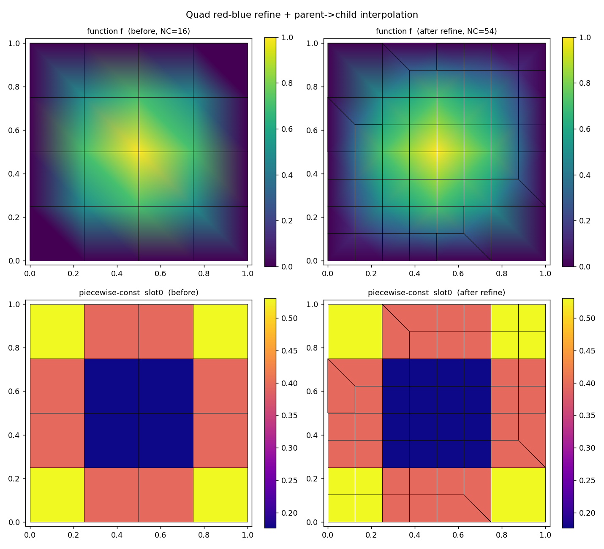

# DECISION: Quad red-blue refinement + parent→child interpolation

作用: 记录 `fracturex/mesh/halfedge_mesh.py::AdaptiveHalfEdgeMesh2d` 中新增的
四边形红蓝(红蓝, 无挂点)加密 `refine_quad_rb` 与父→子继承插值
`inherit_nodal_data` / `inherit_cell_data` 的关键设计取舍。参照实现为 fealpy2
`fealpy_old_2/.../half_edge_mesh_2d.py::HalfEdgeMesh2d.refine_quad`
(只读 oracle, 不修改 fealpy)。

## 背景

fealpy2 的 `refine_quad` 调用 `refine_cell(method='quad_coordinateCell')`——该
分支在仓库任何副本里都不存在, 静默返回 `None`, 所以旧代码的 blue→red 过渡闭合
其实是空操作, 四边形加密只在均匀情形下能用。新架构下完全重写。

Halfedge 行布局: `[to_node, cell, next, prev, opposite]`。边界 halfedge 在新
架构里是**自反的**(`opp(h)==h`), 没有 fealpy2 的显式外环, 所以 2×2 网格
NHE=16 (oracle 是 24)。加密的正确性以内部着色和过渡闭合与 oracle 一致为准,
已用 6 个算例逐一对齐 (计数 + 保面积 + 无挂点)。

## 颜色约定

`self.halfedgedata['color']`(int64, 长度 NHE): `0=red`(常规四边形边),
`1=green`(中心↔中点辐条), `2=blue`(过渡边, 粗侧), `3=yellow`(过渡边, 细侧)。
`['colorlevel']` 同长度, 记录 green/blue 的层级 (被二分次数)。

## 关键取舍

1. **color/colorlevel 必须是 plain `ndarray`, 不能是 `DynamicArray`。**
   Why: `mark_halfedge('quad')` 依赖逐元素 `color == k`; `DynamicArray` 把
   `__eq__` 代理成标量比较, 返回单个 `False`, 使闭合循环只走 opposite 传播,
   欠二分, 生成五边形。How to apply: `_init_quad_color` 与 `refine_quad_rb` 末尾
   都以 `np.asarray(...).copy()` 读入、以 plain ndarray 写回。

2. **二分边着色用“单色边”规则 `color[new] = color[halfedge[new,2]]`,
   而不是 fealpy2 的 opposite 惯用法。**
   Why: 新架构 `refine_halfedge` 的编号与 fealpy2 不同; 用 opposite 会把自反
   边界半边的两半着错奇偶, 嵌套二次加密时产生 6 处 red/green 奇偶失配 (NV=5
   单元)。单色边规则让二分边的后半继承其 `next` 所指前半的颜色, 边界正确。
   How to apply: Phase A 中对 `new_idx = arange(NHE0, NHE_A)` 应用。

3. **Phase C 起始半边用几何规则, 不用 opposite 颜色算术。**
   规则: `isStartHEdge = (未二分的既有 green | 被二分的 spoke) & 属于新单元(NV∈{6,8})`。
   Why: fealpy2 的 `opp_new` 颜色算术不映射到新架构 `refine_halfedge` 编号。
   该几何规则经验上与 oracle 起始集完全一致 (16/16, 10/10, 22/22, 0 多余)。

4. **`_refine_poly_cell_` 增加可选 `center=` 参数, 而不是复制一个
   `_refine_quad_cell_`。**
   Why: NV=6 过渡单元的面积加权质心 ≠ 四边形几何中心, 中心分裂需要显式传入正确
   中心。默认路径 (`center=None` → `cell_barycenter`) 逐字节不变, `refine_poly`
   不受影响。选择加参数是为了最小化指针手术面。

5. **插值用父→子继承 (精确), 而非背景三角网格点定位。**
   Why: 红蓝加密只**追加**节点 (旧节点索引保持不变), 且子单元精确嵌套在父四边形
   内。所以: 节点函数 = 父四边形双线性形函数插值 (中点=两端点均值, 中心=四角均值,
   双/线性场精确复现); (NC,NQ) 分片常数 = 子单元质心定位父四边形后直接拷贝该行。
   无需穿过 Phase B(合并)/Phase C(分裂)追踪单元来源。
   How to apply: 调用方须在 `refine_quad_rb` **之前**快照
   `node_old = m._node_view().copy()`, `cell_old = m.cell_to_node().copy()`,
   加密后传给 `inherit_nodal_data(f_old, node_old, cell_old)` /
   `inherit_cell_data(cd_old, node_old, cell_old)`。
   点定位用凸四边形叉积包含判据 (`_locate_in_quads`), 逆双线性映射用 Newton
   (`_bilinear_weights`)。

## 验证

- `fracturex/tests/test_halfedge_quad_rb.py` (21 tests, 全过):
  - unit: 均匀加密计数 `NN'=NN+NE+NC, NC'=4NC, NE'=2NE+4NC`; 线性/双线性节点场
    精确复现 (err < 1e-9); 旧节点值不变。
  - smoke: 部分加密后 color/colorlevel/hlevel 长度==NHE, clevel 长度==NC_all。
  - regression: 部分/嵌套加密后 opp 对合、next/prev 互逆、叶单元皆四边形、内部边
    无挂点; 总面积不变 (rtol 1e-12)。
- 演示脚本 `scripts/demo_quad_rb_interp.py`: 初始网格 + 节点函数 + (NC,NQ) 分片
  常数 → 加密对角带单元 → 插值 → 输出加密前后 2×2 对比图。结果图见
  `docs/architecture/quad_rb_interp_demo.png` (上排: 节点函数 f, Gouraud 连续
  着色; 下排: (NC,NQ) 分片常数 slot0, 每单元一色; 左加密前右加密后)。重跑:
  `python scripts/demo_quad_rb_interp.py --out docs/architecture/quad_rb_interp_demo.png`。

命令: `source ~/venv_fealpy3/bin/activate && python -m pytest
fracturex/tests/test_halfedge_quad_rb.py -q` (21 tests 全过)。

## coarsen_quad_rb (红蓝加密的逆)

**关键发现: fealpy2 oracle `coarsen_quad` 本身是坏的**——只有 1×1 能跑, 任何
多于一个单元的网格都在 `bc[isNewCell] = newNode[isNewCell[-nn:]]` 处 shape
mismatch crash (与 refine 依赖不存在的 `quad_coordinateCell` 同源: fealpy2 的
四边形自适应路径从未真正可用)。所以 coarsen 没有可移植/可对齐的 oracle, 从头写 +
自验证 (用户确认此方案)。

实现取舍: **不重写指针手术, 直接复用已验证的 `coarsen_poly`**。
- Why: 探针证明 `coarsen_poly` (中心节点移除 + 边反二分 + 自带的 2:1 层平衡标记
  传播) 已经是 `refine_quad_rb` 的正确拓扑逆——均匀/含过渡/嵌套 round-trip 都
  精确复原 NC/NN/NE 且保面积、全四边形、无挂点。
- `coarsen_quad_rb` 只在其上补两件事: (1) 用 `_init_quad_color` 重建
  color/colorlevel (coarsen_poly 不维护颜色); (2) 若非对称部分标记留下 NV≠4 的
  过渡多边形, 直接报错要求标记完整的加密组 (而不是错误着色)。
- How to apply: 调用 `m.coarsen_quad_rb(isMarkedCell)`; 只有 clevel>0 的单元
  可被真正移除。验证 refine→coarsen 精确复原、coarsen→再 refine 仍保形。

测试 (`test_refine_coarsen_roundtrip` 等 3 个): 均匀 1×1/2×2/3×3、部分 4×4
(corner / several)、嵌套 ×2、coarsen 后再 refine——全部保形复原。
