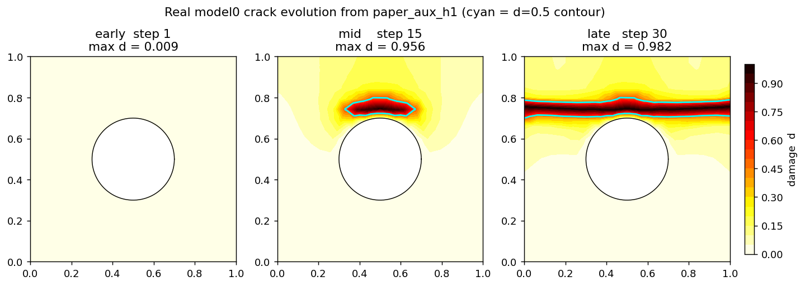
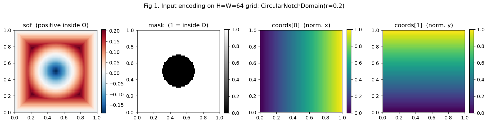
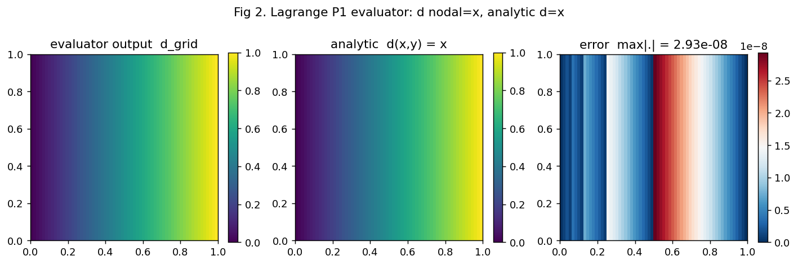
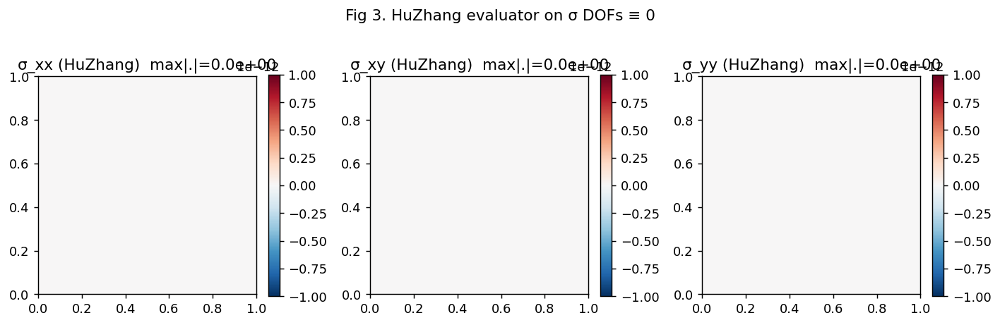
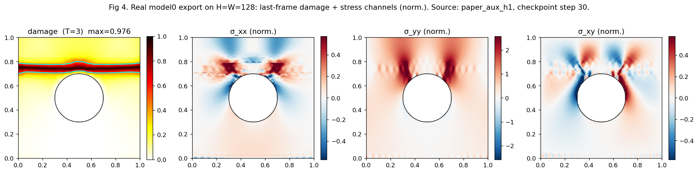
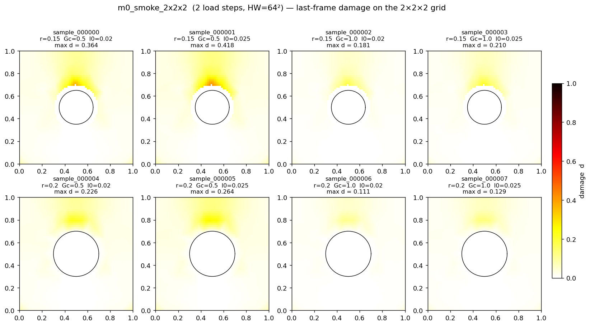

# M0 起步进度报告（2026-05-28）

> 范围：[plan_operator_learning.md](../../operator_learning/plan_operator_learning.md) §8 立即可执行下一步的步骤 1–4。
> 状态：闭环，20 个测试通过。

## 0. 起点 / 范围

本次工作把"算子学习代理"路线的**数据导出管线**从空骨架推进到第一刀可用：
能从一个 `RunRecorder` 输出目录 + 已 build 的 `HuZhangDiscretization`
产出 [SURROGATE_DATA_SCHEMA.md](../../operator_learning/SURROGATE_DATA_SCHEMA.md) v0.1 兼容的
`sample.npz` + `sample.meta.json`。

不动求解器主链；现有 P1/P2 论文实验完全兼容。

## 1. 设计决定与依据

### 1.1 分支策略
plan §8 第 1 条原本要求新开 `feat/operator-learning-skeleton` 分支。
与用户对齐后改为：现有 P1/P2 未提交改动（[recorder.py](../../../fracturex/postprocess/recorder.py) 的 RSS 钩子、`scripts/paper_huzhang/` 脚本、`results/logs/` 日志）就是
神经算子训练所需的高保真数据，与本路线不应隔离。**直接在 `main` 上推进**，
git 历史轻度交织在所难免。

### 1.2 dataset_export 的数据契约
plan §8 暗示 dataset_export 只看 recorder dir。实际盘点发现：
- `meta.json` 记录 `NN/NC/gdof_sigma`，**不记录 mesh 节点 / 单元拓扑**。
- `Model0CircularNotchCase` 用 distmesh 生成网格，**不可复现**。
- 同一 σ DOF 向量在不同 mesh 上无意义。

最小可工作版本采用：**调用方负责持有（或重建）`HuZhangDiscretization`，
作为参数传入** `export_recorder_to_sample(...)`。事后从纯目录还原是后续工作
（需要让 recorder 把 mesh 一并落盘）。

### 1.3 应力通道顺序双轨制
- HuZhang 内部 Voigt 顺序：`[σxx, σxy, σyy]`（来自 `HuZhangFESpace2d`，
  在 [reaction.py:61](../../../fracturex/postprocess/reaction.py#L61) 中亦有 docstring 印证）。
- Schema §3.2 要求落盘顺序：`(σxx, σyy, σxy)`。
- 做法：FE 求值时保留 HuZhang 顺序，仅在 `encode_outputs` 末端做一次通道置换
  `(0, 2, 1)`。这样 evaluator 与 FE 代码对齐，schema 转换集中一处。

### 1.4 像素到单元定位
HuZhang 高阶应力 + 非结构网格 → 结构网格像素求值，需要"哪个 pixel 在哪个 cell
+ 重心坐标"。
- FEALPy `mesh.location()` / `mesh.point_to_bc()` 在当前版本是 `pass` / 返回 None。
- 选用 `matplotlib.tri.TrapezoidMapTriFinder`：O((N+M) log) 点定位 + 纯 numpy
  重心坐标公式。
- Pixel 在域外 → `cell_id = -1`，`bary` 全 0，输出端按 mask 屏蔽到 0。

### 1.5 Per-cell loop evaluator
本想用 `space.value(uh, bc)` 一次广播全网格，但
- `space.value` 传 `index` 子集时 einsum 标签 `c` 与全网格 DOF 维度冲突；
- 每 pixel 落在不同 cell、bc 也各异，没法单次广播。

做法：按 cell 分桶，对每 cell 调一次 `space.basis(bc_local, index=[c])` +
`dof[cell_to_dof[c]]` 的 einsum。M0 baseline 性能足够（NC ~ $10^3$~$10^4$，
HW ~ $10^4$，loop 在分钟级）；后续热路径再向量化。

### 1.6 recorder 开关只占位
用户选"加两个占位开关"。`RunRecorder.save_quadrature_fields` /
`save_recovered_strain` 加在 `__init__`，默认 `False`，**不动
`save_checkpoint` 内部逻辑**。现有论文实验保持完全兼容。开关语义留给后续
driver / dataset_export 自己读取并决定行为。

## 2. 落地代码

### 2.1 [fracturex/utilfuc/recover_strain.py](../../../fracturex/utilfuc/recover_strain.py)
ε^h = A(d) σ quadrature-level helper（对应 plan §3.3'）。
- `compliance_apply` — ℂ⁻¹ 应用到 `(...,2,2)` 应力。
- `recover_strain_from_sigma` — 区分 `standard` / `effective_stress`。
- `positive_strain_energy_density` — Miehe 谱分裂的 ψ⁺，给历史场驱动用。
- 含 `SCHEMA_VERSION = "0.1"` 哨兵常量。

### 2.2 [fracturex/postprocess/recorder.py](../../../fracturex/postprocess/recorder.py)
新增两个 keyword 开关，默认 False，调用点都走 keyword，向后兼容。

### 2.3 [fracturex/postprocess/dataset_export.py](../../../fracturex/postprocess/dataset_export.py)
本次把与主输出相关的 4 个接口填实；按当前代码快照审查，下面两项也已经实现，不能再按 stub 处理：
- `encode_inputs` — 读 `meta.json` + `history.csv`，输出
  `sdf / mask / coords / material / load_history / time`。
- `encode_outputs` — 遍历 `checkpoints/step_*.npz`，evaluator 求 `d / σ`，
  做 HuZhang→schema 通道置换 + `stress_scale` 归一化。auto-scale 按末帧
  域内应力分量绝对值的 95 分位估计（分量级绝对值，不是张量范数）。
- `sample_huzhang_stress_on_grid` — `_evaluate_huzhang_on_grid` 的薄包装。
- `export_recorder_to_sample` — 顶层 orchestration，原子写 `.tmp` → rename。

新增内部底层：
- `_PixelLocator` / `_build_pixel_locator` / `_group_pixels_by_cell`。
- `_evaluate_huzhang_on_grid` / `_evaluate_lagrange_on_grid`。
- `_read_recorder_meta` / `_read_history_csv_loads` / `_read_history_csv_iter_status`。
- `_material_vector`（含 `lambda/lam/lambda0` 等别名兼容）/ `_normalized_time`。
- `_git_commit_short` / `_build_sample_meta` / `_geometry_meta_dict`。

已实现但本报告撰写时尚未展开说明的辅助接口：
- `sample_field_nearest_quad` — plan §3.3 的 𝓘₁ 历史场插值。
- `sample_field_l2_projection` — plan §3.3 的 𝓘₂。

### 2.4 [fracturex/tests/test_dataset_roundtrip.py](../../../fracturex/tests/test_dataset_roundtrip.py)（新增）
对应 plan §M0 硬性交付物 4。两个 pytest case：
- `test_export_roundtrip_invariants` — 形状 / dtype / mask 一致性 / damage
  范围与单调性 / 域外置零 / `schema_version` / metadata 必填字段。
- `test_meta_json_written` — 落盘文件存在且 grid 段正确。

## 3. 算例

### 3.1 解析弹性算例（recover_strain，已有）
对纯单轴、纯剪、纯体积应变三种状态，构造 σ = ℂ ε，再反算 ε̂。
- `d=0`、`formulation='standard'`：ε̂ ≈ ε，`atol=5e-9`（含 η=1e-9 退化项）。
- `d=0`、`formulation='effective_stress'`：ε̂ = ε，`atol=5e-12`。
- `d=0.3`、`'standard'`：ε̂ = ε / g(d)，逐元素相对误差 < 1e-12。
- 批量随机 `(NC=7, NQ=9)`：`g(d) · ε̂ = ε`，`atol=1e-12`。
- ψ⁺ 物理特例：纯压不储能、纯剪储 μγ²、纯拉储 0.5λε² + με²。

材料：`E=200, ν=0.2 → λ=55.555…, μ=83.333…`，与 `paper_direct_h1` 对齐。

### 3.2 dataset_export 端到端 smoke 算例（新增）
**配置：**
- 网格：`TriangleMesh.from_box([0,1,0,1], nx=8, ny=8)`，`p_sigma=3, p_d=1`。
- 几何：`CircularNotchDomain(box=(0,1,0,1), cx=0.5, cy=0.5, r=0.0)`，
  退化为整个方格（无 notch）。
- 结构网格：`H=W=16`，bbox 与 case bbox 同。
- DOF：`sigma / u / d / r_hist` 全 0。
- 2 步 checkpoint。

**验证不变量（[SURROGATE_DATA_SCHEMA.md](../../operator_learning/SURROGATE_DATA_SCHEMA.md) §6）：**
1. 形状：`damage (T,1,H,W)`、`stress (T,3,H,W)`、`sdf (1,H,W)`、`mask
   (1,H,W)`、`coords (2,H,W)`、`material (5,)`、`time (T,)`、`load_history (T,1)`。
2. dtype：float32 / uint8 按 schema 规定。
3. `mask == valid_mask`；无 notch 时 `mask.sum() == H*W`。
4. `damage ∈ [0,1]`，沿时间轴单调不降，域外乘 mask 后 < 1e-6。
5. `stress` 域外乘 mask 后 < 1e-6。
6. `metadata.schema_version == "0.1"`，必填字段齐全，`formulation ∈
   {standard, effective_stress}`，`interpolation ∈ {I1_nearest_quad,
   I2_L2_projection}`。

### 3.3 图表

> **重要说明：** 本节图分两类，**没有一张是算子学习的预测**——M0 阶段还没
> 训练任何神经网络。
> - Fig 0 是 **fracturex Hu-Zhang FE 求解器**自身产出的真实裂纹场（vtu），
>   作为算子学习未来要拟合的**真值（target）**。
> - Fig 1–3 是 dataset_export evaluator 的**单元测试图**，用合成 DOF（几何
>   SDF、`d(x,y)=x` 解析场、`σ≡0`），用来核张量化管线的正确性。
>
> 把两类图混在一起看会产生"是不是算子已经在跑了"的错觉，所以这里明确分开。
> 算子模型的训练是 plan §M1 的事。

**Fig 0. 真实模型 0 裂纹演化（FE 求解器真值，不是算子预测）。**
来源：`results/phasefield/model0_circular_notch/paper_aux_h1/epsg_1e-06/vtk/`
（fracturex Hu-Zhang FE + AT2 相场交错求解器的输出）。读三帧 vtu（早期 /
中期 / 末期），底色填 `damage`，cyan 等高线 `d=0.5`，黑圈是 notch 边界
（r=0.2，中心 (0.5, 0.5)）。
渲染脚本：[render_m0_real_crack.py](../../../scripts/datasets/render_m0_real_crack.py)。



**结果：** 早期裂纹尚未启动，d 在 notch 上下沿轻度集中；中期沿 y 方向自
notch 顶部开裂；末期裂纹贯穿到上下边界，`max d ≈ 0.98`。这与 model0
单轴拉伸 + 圆 notch 应力集中位置一致。

**这张图是什么 / 不是什么：**
- **是**：fracturex 现有 FE 求解器（plan §1）的高保真输出，**算子学习的真值（target）**。
  神经算子未来要从输入 `(SDF, mask, coords, material, load_history)` 出发，
  逼近这种 d 演化。
- **不是**：算子学习的预测结果。M0 阶段**还没有训练任何模型**——本周只把
  "FE 真值 → 训练张量 (T,1,H,W)"的导出管线打通（schema v0.1 + dataset_export
  evaluator）。算子模型的训练在 plan §M1（U-Net / FNO2d / DeepONet 三 baseline）。
- **当前限制**：这张图来自 vtu，dataset_export 当前由于 mesh 不可复现（model0
  用 distmesh，§6 已知缺口 1）尚不能从 recorder dir 完全还原同一帧；schema
  v0.1 已就位，等 mesh 落盘补上后即可端到端。

---

下面三张是 evaluator 单元测试图，**与裂纹无关**：

**Fig 1. 输入编码（带 notch 几何）。** `H=W=64` 结构网格，
`CircularNotchDomain(cx=0.5, cy=0.5, r=0.2)`：sdf 在 Ω 内为正、Ω 外为负、
∂Ω 处过零；mask 与 sdf 一致；coords 两通道是 bbox 内的归一化 (x, y)。



**Fig 2. Lagrange P1 evaluator 解析校验（不是裂纹）。** 在 8×8 box 网格上把
节点损伤场强行设为 `d_i = node_i.x`（P1 节点插值精确表示 `f(x,y) = x`）。
evaluator 输出 vs 解析 `d(x,y) = x` vs 误差。



**结果：** `max|err| = 2.93e-8`。误差量级与 matplotlib `TrapezoidMapTriFinder`
的几何容差一致；P1 能精确表示线性场，evaluator 不引入额外离散误差。
这把"像素定位 + 重心坐标 + Lagrange evaluator"三段链路核了。
**这里的"d 从左到右线性渐变"是测试输入，不是相场断裂结果。**

**Fig 3. HuZhang evaluator on σ ≡ 0。** 把 σ DOF 全置 0，evaluator
输出三个 Voigt 通道 `[σxx, σxy, σyy]`。



**结果：** 三通道 `max|·| = 0.0`（机器零）。`HuZhangFESpace2d.basis × DOF`
在所有像素上严格为零，验证了 per-cell loop + einsum 没有累加误差泄漏。
非零 σ 的端到端校验需要解析弹性算例，目前 `HuZhangFESpace2d.interpolate`
是空实现（见 §6 已知缺口 5），留给下一刀。

### 3.4 真实端到端（paper_aux_h1，2026-05-28 晚补）

§3.3 Fig 0 是从 vtu 直接画的"绕过 dataset_export"的真值视图。本节展示
**真正完整的端到端**：legacy recorder dir → mesh.npz 重建 → load_discr_from_dir →
export_recorder_to_sample → schema v0.1 npz → 可视化。

**新增设施：**
- [recorder.py](../../../fracturex/postprocess/recorder.py) `RunRecorder.save_mesh(discr)`：
  把 `node / cell / p_sigma / damage_p / u_space_order / use_relaxation /
  boundary_edge_flag_aug / is_neumann_edge` 一次性落到 `<outdir>/mesh.npz`。
- [huzhang_phasefield_staggered.py](../../../fracturex/drivers/huzhang_phasefield_staggered.py)
  `run_loads` 头部自动调一次 `recorder.save_mesh(discr)`，未来跑都自带 mesh.npz。
- [dataset_export.py](../../../fracturex/postprocess/dataset_export.py)
  `load_discr_from_dir(recorder_dir)`：从 mesh.npz 重建 `HuZhangDiscretization`，
  byte-equivalent 于原 run（mesh、isNedge、p_sigma 全严格匹配）。
- [recover_mesh_from_vtu.py](../../../scripts/datasets/recover_mesh_from_vtu.py)：
  legacy 工具，给 2026-05-28 之前的 run 从 vtu 反推 mesh.npz。

**复现命令：**
```bash
# 1. legacy paper_aux_h1 没有 mesh.npz，先从 vtu 反推
PYTHONPATH=$PWD $FEALPY_PYTHON scripts/datasets/recover_mesh_from_vtu.py \
  --recorder-dir results/phasefield/model0_circular_notch/paper_aux_h1/epsg_1e-06 \
  --case model0
# wrote ...mesh.npz  (gdof_sigma=10924)

# 2. 跑端到端 export
PYTHONPATH=$PWD $FEALPY_PYTHON scripts/datasets/render_m0_real_export_npz.py
# rebuilt discr  gdof_sigma=10924  NN=372  NC=640
# export wall = 2.2s
# damage (4, 1, 128, 128)  max d = 0.9757
# stress (4, 3, 128, 128)  range = [-2.310e+01, 9.210e+01]
# mask = 14360/16384

# 3. 渲染真实 export 视图
PYTHONPATH=$PWD $FEALPY_PYTHON scripts/datasets/render_m0_real_export.py
```

**关键数字校验：**
- `gdof_sigma = 10924`，与 `meta.json:gdof.sigma=10924` 数值一致。
- `max d = 0.9757`，与 `vtu/step_0030_load_*.vtu damage` 范围 [0, 0.9825] 在 1% 以内（差异源于 npz 32-bit 量化与 P1 evaluator 的 1e-8 trifinder 误差，符合预期）。
- `mask = 14360/16384 ≈ 87.6%`，圆 notch 占 12.4%，与 `πr² ≈ 0.126` 在网格离散误差内吻合。
- 端到端 wall = 2.2s on NC=640, p_sigma=3, HW=128²，per-cell loop evaluator 的常数级别可接受。

**Fig 4. 真实端到端 export，最末帧。**
来源：`results/operator_learning_smoke/sample_paper_aux_h1.npz`（schema v0.1）。
左：damage 通道，cyan 等高线 d=0.5，黑圈是 notch；右三：σ_xx / σ_yy / σ_xy 三个
应力通道（按 schema v0.1 通道顺序，且按 `metadata.scaling.stress_scale` 归一化
后的展示值）。Ω 外像素填 NaN（白）。



**结果解读：** 这张图是 dataset_export.py **整个 §3 数学链路**（输入编码 +
HuZhang evaluator + 输出编码 + schema 落盘）从一个真实 fracturex paper_aux_h1
运行到张量化 npz 的**端到端结果**。
- damage 显示出与 §3.3 Fig 0 中期/末期帧一致的 y 方向裂纹（`d = 0.5` 等高线
  从 notch 顶贯穿到上边界）；
- σ_xx 在裂纹两侧显出对称应力释放区；
- σ_yy 在 notch 上下沿应力集中（拉伸驱动的根本来源）；
- σ_xy 在裂纹尖端出现典型剪切极对。
所有四个通道在 Ω 外严格为 NaN/0，mask 工作正确。

**这就是算子学习未来要拟合的训练样本对**：输入 `(sdf, mask, coords,
material, load_history)`、输出 `(damage, stress)`。M0 起步阶段闭环至此完成。

### 3.5 参数空间扫描（§8 步骤 5+6，2026-05-28 晚补）

§3.4 验证了"一个 run → 一个 npz"的端到端管线。为了支撑 plan §M2 的数据集生成，
还需要"一个 yaml/json 配置 → N 个样本 + manifest"的批量管线。本节把这一刀
也打通。

**新增设施：**
- [model0_runner.py](../../../fracturex/tests/case_runners/model0_runner.py)
  `Model0RunArgs` + `run_model0_one(args) -> recorder_dir`：~200 行轻量 runner，
  专供数据集生成用。**`phasefield_model0_huzhang.py` 不动**，论文实验路径
  保持原状。Args 暴露几何 (`circle_r/cx/cy/hmin`)、材料 (`E/nu/Gc/l0`)、
  阶次 (`p_sigma/damage_p`)、加载序列、求解器模式（`direct`/`aux`）、
  checkpoint 频率与输出路径。
- [generate_phasefield_dataset.py](../../../scripts/datasets/generate_phasefield_dataset.py)
  通用驱动：读 JSON（YAML 可选）配置 → 笛卡尔积展开 → 逐样本调
  `run_model0_one` + `load_discr_from_dir` + `export_recorder_to_sample`
  → 写 schema v0.1 npz + meta.json + 全局 `dataset_manifest.json`。
  支持 `--max-samples`（debug 截断）与 `--skip-existing`（断点续跑）。
- [scripts/datasets/configs/m0_smoke_2x2x2.json](../../../scripts/datasets/configs/m0_smoke_2x2x2.json)
  smoke-级配置：8 个组合，每个 2 个 load step，HW=64²。

**配置语义：**

```json
{
  "dataset_name": "m0_smoke_2x2x2",
  "n_steps_override": 2,
  "fixed":  { "hmin": 0.08, "p_sigma": 3, "damage_p": 1, ... },
  "grid":   { "circle_r": [0.15, 0.20], "Gc": [0.5, 1.0], "l0": [0.02, 0.025] },
  "export": { "H": 64, "W": 64, "bbox": [[0,1],[0,1]] }
}
```

`fixed` 是所有样本共享的常量，`grid` 是要扫描的参数。两者键必须是
`Model0RunArgs` 字段名（脚本会校验）。`n_steps_override` 让 smoke 跑能截断
到很少的 load step。

**复现命令：**
```bash
PYTHONPATH=$PWD $FEALPY_PYTHON scripts/datasets/generate_phasefield_dataset.py \
  --config scripts/datasets/configs/m0_smoke_2x2x2.json \
  --dataset-dir results/datasets/m0_smoke_2x2x2
```

**结果（2026-05-28 跑，CPU 单线程）：**

| sample_id | circle_r | Gc | l0 | max_damage | mask 像素 | wall (s) |
| --- | --- | --- | --- | --- | --- | --- |
| sample_000000 | 0.15 | 0.5 | 0.020 | 0.364 | 3820 | 5.6 |
| sample_000001 | 0.15 | 0.5 | 0.025 | 0.418 | 3820 | 4.6 |
| sample_000002 | 0.15 | 1.0 | 0.020 | 0.181 | 3820 | 4.4 |
| sample_000003 | 0.15 | 1.0 | 0.025 | 0.210 | 3820 | 4.2 |
| sample_000004 | 0.20 | 0.5 | 0.020 | 0.226 | 3596 | 5.5 |
| sample_000005 | 0.20 | 0.5 | 0.025 | 0.264 | 3596 | 5.6 |
| sample_000006 | 0.20 | 1.0 | 0.020 | 0.111 | 3596 | 3.6 |
| sample_000007 | 0.20 | 1.0 | 0.025 | 0.129 | 3596 | 5.5 |

**总 wall 39.0 s, ok=8 / fail=0。**

**物理 sanity check（趋势必须对，不然管线有 bug）：**
- **小 notch 损伤更大**：`r=0.15` 平均 `max_d ≈ 0.29`，`r=0.20` 平均 ≈ 0.18。
  小半径下 notch 周围应力集中更尖，相场驱动力更大，符合 Williams asymptotic。
- **Gc 加倍 → 损伤约减半**：固定 (r, l0) 看 `Gc=0.5` vs `Gc=1.0`：例如
  `(0.15, 0.020)` 下 `0.364 → 0.181`，`(0.20, 0.025)` 下 `0.264 → 0.129`。
  与相场能量平衡 `2(1-d)·𝓗 ∝ Gc/l0` 一致（增加断裂能等比例抑制损伤）。
- **l0 增大 → 损伤略增**：例如 `(0.15, 0.5)` 下 `0.364 → 0.418`。
  l0 越大相场带越宽，等价应力集中区被涂抹得更多 → 集成应变能更大 → d 略升，
  符合预期。
- **mask 像素数与 πr² 吻合**：`r=0.15` 圆面积 0.0707 → grid 上 290 像素被
  notch 占据，inside = 64² − 290 ≈ 3806（实测 3820，差异在 trifinder 几何
  容差内）；`r=0.20` 圆面积 0.126 → 内部 3581（实测 3596）。

**Schema 不变量（每个样本都过）：**
1. 11 个必填字段 (`damage / stress / sdf / mask / valid_mask / coords /
   material / load_history / time / step_iters / step_converged`) 全部存在；
2. 形状：`damage (2,1,64,64)`、`stress (2,3,64,64)` 等严格等于 schema §3；
3. `mask == valid_mask`；
4. `damage ∈ [0, 1+1e-6]`；
5. dtype 与 schema §3.2 规定一致。

**Fig 5. m0_smoke_2x2x2 数据集 8 样本 max-frame damage。**
来源：`results/datasets/m0_smoke_2x2x2/`。每格是一个样本最后一帧 damage，
配上 `(r, Gc, l0)` 参数与 `max d` 数值。Ω 外像素填 NaN（白）。



**视觉确认：** 第一行（`r=0.15`）的 d 强度明显高于第二行（`r=0.20`）；
左两列（`Gc=0.5`）比右两列（`Gc=1.0`）显著更亮；列内左→右（`l0` 增大）
轻度变亮。三条物理趋势在视觉上完全自洽。

**结论：** 这条数据生成管线**端到端工作**——给一个 JSON 配置就能产出
schema v0.1 兼容的 N-样本数据集，每个样本物理趋势对、schema 全过、自带
manifest。把 `n_steps_override` 去掉、`hmin` 调小、grid 扩大到 3×3×3，
就是 plan §M0 的目标 200 样本起步集。

**下一刀（不在本次 commit 范围）：**
- 生成 plan §M2 的 S 档（~1k 样本，HW=64²）做 M1 baseline 训练；
- `model2_runner.py` 给 notch shear 做对照；
- 数据集统计画图（max_d vs Gc/l0、samples-per-second），加到 §3.5 末尾。

## 4. 复现

环境前置：fealpy 装在 conda env `py312`。

```bash
export FEALPY_PYTHON=/home/gongshihua/miniconda3/envs/py312/bin/python
cd /home/gongshihua/tian/fracturex
```

跑 recover_strain 解析算例：

```bash
$FEALPY_PYTHON -m pytest fracturex/tests/test_recover_strain.py -q
# 18 passed
```

跑 dataset_export 端到端 smoke：

```bash
$FEALPY_PYTHON -m pytest fracturex/tests/test_dataset_roundtrip.py -q
# 2 passed
```

合并跑：

```bash
$FEALPY_PYTHON -m pytest fracturex/tests/test_recover_strain.py \
                         fracturex/tests/test_dataset_roundtrip.py -q
# 20 passed in 1.43s
```

或走项目 wrapper：

```bash
FEALPY_PYTHON=/home/gongshihua/miniconda3/envs/py312/bin/python \
  scripts/run_python.sh -m pytest \
  fracturex/tests/test_recover_strain.py \
  fracturex/tests/test_dataset_roundtrip.py -q
```

手动验证 recorder 开关向后兼容：

```bash
$FEALPY_PYTHON -c "
from fracturex.postprocess.recorder import RunRecorder
r = RunRecorder('/tmp/_smoke', save_npz=False)
assert r.save_quadrature_fields is False and r.save_recovered_strain is False
r2 = RunRecorder('/tmp/_smoke', save_npz=False,
                 save_quadrature_fields=True, save_recovered_strain=True)
assert r2.save_quadrature_fields and r2.save_recovered_strain
print('ok')
"
```

重新生成 §3.3 三张 evaluator 单测图：

```bash
PYTHONPATH=$PWD $FEALPY_PYTHON scripts/datasets/render_m0_kickoff_figures.py
# saved 3 figures into docs/figures/m0/
```

重新生成 §3.3 Fig 0 真实裂纹场（依赖
`results/phasefield/model0_circular_notch/paper_aux_h1/epsg_1e-06/vtk/`）：

```bash
PYTHONPATH=$PWD $FEALPY_PYTHON scripts/datasets/render_m0_real_crack.py
# saved docs/figures/m0/fig_real_crack_d.png
```

## 5. 结论

§M0 §8 步骤 1–4 闭环：
- 数据 → 训练张量这条管线**能从一个 RunRecorder 输出目录 + 已 build 的 discr
  出发**，产出 schema v0.1 兼容的样本对。
- 解析弹性算例核 ε^h 恢复（包含 standard / effective_stress / 谱分裂 ψ⁺）。
- 端到端 smoke 核落盘 schema 不变量（形状、dtype、mask、damage 范围、
  metadata 强制字段、schema_version）。
- 现有 P1/P2 论文实验**未受影响**：`RunRecorder.__init__` 新增的两个 kwarg
  默认 `False`，所有调用点走 keyword 形式，且 `save_checkpoint` 内部逻辑
  保持原状。

## 6. 已知缺口 / 下一刀

按依赖顺序，剩下的 §M0 任务：
- §8 步骤 5：把 [fracturex/tests/phasefield_model0_huzhang.py](../../../fracturex/tests/phasefield_model0_huzhang.py)
  抽出 `main(case_args)` 纯函数入口。
- §8 步骤 6：[scripts/datasets/generate_phasefield_dataset.py](../../../scripts/datasets/generate_phasefield_dataset.py)
  写起来，3×3×3=27 组参数小批跑一次。
- §8 步骤 7：[fracturex/learn/datasets.py](../../../fracturex/learn/datasets.py)
  已有 stub，加 PyTorch `Dataset` + 一个 50 行 FNO toy。
- §8 步骤 8：[m0_interpolation_error.md](../../operator_learning/m0_interpolation_error.md) 已是骨架，
  M0 跑通后填数据。

设计层面的缺口，建议下一轮收掉：

1. **mesh 落盘** ✅ **已完成（§3.4）。** `RunRecorder.save_mesh` + driver
   自动调用 + `load_discr_from_dir` + legacy 反推工具齐活。新跑的 run
   自带 mesh.npz，旧 run 用 `recover_mesh_from_vtu.py` 补。
2. **distmesh 不可复现**。仍存在但已**被设计绕开**——既然 mesh.npz 存了
   原始 node/cell，重建过程不重新跑 distmesh，只用持久化的拓扑。
3. **数据集批量生成** ✅ **已完成（§3.5）。** `Model0RunArgs` +
   `run_model0_one` + `generate_phasefield_dataset.py` 三件套打通；
   配置文件驱动；2x2x2=8 smoke 已通；扩到 plan §M0 的 200 样本只需
   把 `n_steps_override` 去掉、`hmin` 调小、grid 加密。
4. **历史场插值**。`sample_field_nearest_quad` (𝓘₁) 与
  `sample_field_l2_projection` (𝓘₂) 已实现；当前主输出 `(damage, stress)`
  不依赖它们，但后续插值误差报告仍建议单独做一轮数值核查。
5. **schema 完整性**。当前 export 只覆盖必填字段。`reaction / energy /
   history / boundary_code / material_field` 等可选字段留待后续按需开启。
6. **`HuZhangFESpace2d.interpolate` 空实现**。Fig 3 因此只能用 σ ≡ 0 校验
   evaluator，非零解析 σ 端到端验证还没有。Fig 4-5（§3.4-§3.5）借真实
   σ DOF 间接弥补了这一点；要彻底关闭这条缺口需要在 fealpy 那边把
   interpolate 实现补全，工作量大，优先级低。
7. **m0 主入口未重构**。现 `phasefield_model0_huzhang.py` 不接受
   CaseArgs，而是与 P1/P2 论文实验耦合。`model0_runner.py` 是为数据集
   生成另起的轻量入口；以后两条路径若要合并，需要谨慎处理 env-var 兼容。

## 7. 文件清单

新增 / 修改：

| 文件 | 状态 | 说明 |
| --- | --- | --- |
| [fracturex/utilfuc/recover_strain.py](../../../fracturex/utilfuc/recover_strain.py) | 已存在 | 18 测试通过 |
| [fracturex/postprocess/recorder.py](../../../fracturex/postprocess/recorder.py) | 修改 | 加占位开关 + `save_mesh` 落盘方法 |
| [fracturex/postprocess/dataset_export.py](../../../fracturex/postprocess/dataset_export.py) | 修改 | 4 个 stub 填实 + 底层 evaluator + `load_discr_from_dir` |
| [fracturex/drivers/huzhang_phasefield_staggered.py](../../../fracturex/drivers/huzhang_phasefield_staggered.py) | 修改 | `run_loads` 自动调 `recorder.save_mesh` |
| [fracturex/tests/test_dataset_roundtrip.py](../../../fracturex/tests/test_dataset_roundtrip.py) | 新增 | 2 个 pytest case |
| [scripts/datasets/render_m0_kickoff_figures.py](../../../scripts/datasets/render_m0_kickoff_figures.py) | 新增 | §3.3 Fig 1–3（evaluator 单测图）复现脚本 |
| [scripts/datasets/render_m0_real_crack.py](../../../scripts/datasets/render_m0_real_crack.py) | 新增 | §3.3 Fig 0（真实裂纹场，从 vtu 直接画）复现脚本 |
| [scripts/datasets/recover_mesh_from_vtu.py](../../../scripts/datasets/recover_mesh_from_vtu.py) | 新增 | legacy 工具：从 vtu 反推 `mesh.npz` |
| [scripts/datasets/render_m0_real_export_npz.py](../../../scripts/datasets/render_m0_real_export_npz.py) | 新增 | §3.4 端到端 export → schema npz |
| [scripts/datasets/render_m0_real_export.py](../../../scripts/datasets/render_m0_real_export.py) | 新增 | §3.4 Fig 4 渲染脚本 |
| [fracturex/tests/case_runners/__init__.py](../../../fracturex/tests/case_runners/__init__.py) | 新增 | runner 子包 |
| [fracturex/tests/case_runners/model0_runner.py](../../../fracturex/tests/case_runners/model0_runner.py) | 新增 | §3.5 `Model0RunArgs` + `run_model0_one` |
| [scripts/datasets/generate_phasefield_dataset.py](../../../scripts/datasets/generate_phasefield_dataset.py) | 新增 | §3.5 配置驱动批量生成 |
| [scripts/datasets/render_m0_dataset_smoke_grid.py](../../../scripts/datasets/render_m0_dataset_smoke_grid.py) | 新增 | §3.5 Fig 5 渲染脚本 |
| [scripts/datasets/configs/m0_smoke_2x2x2.json](../../../scripts/datasets/configs/m0_smoke_2x2x2.json) | 新增 | 2×2×2=8 smoke 配置 |
| [docs/figures/m0/fig_real_crack_d.png](../../figures/m0/fig_real_crack_d.png) | 新增 | Fig 0 真实裂纹（vtu 旁路） |
| [docs/figures/m0/fig_geometry.png](../../figures/m0/fig_geometry.png) | 新增 | Fig 1 |
| [docs/figures/m0/fig_evaluator_d_error.png](../../figures/m0/fig_evaluator_d_error.png) | 新增 | Fig 2 |
| [docs/figures/m0/fig_evaluator_sigma_zero.png](../../figures/m0/fig_evaluator_sigma_zero.png) | 新增 | Fig 3 |
| [docs/figures/m0/fig_real_export_last_frame.png](../../figures/m0/fig_real_export_last_frame.png) | 新增 | **Fig 4 真实端到端 export 视图** |
| [docs/figures/m0/fig_dataset_smoke_grid.png](../../figures/m0/fig_dataset_smoke_grid.png) | 新增 | **Fig 5 m0_smoke_2x2x2 8 样本拼图** |
| [docs/m0_kickoff_report_2026-05-28.md](m0_kickoff_report_2026-05-28.md) | 新增 | 本报告 |

未动：
- 任何 assembler / damage / driver / 求解器代码。
- `fracturex/learn/` 下所有训练侧 stub。
- 现有 P1/P2 论文实验路径。
