# FractureX phase-field benchmarks (Hu–Zhang CaseBase)

Catalog of Ambati / Miehe classical benchmarks wired into
`fracturex.cases` for the Hu–Zhang + staggered phase-field path.

**Primary literature**

* Ambati, Gerasimov, De Lorenzis. *A review on phase-field models of brittle
  fracture and a new fast hybrid formulation.* Comput. Mech. **55**:383–405
  (2015). DOI: [10.1007/s00466-014-1109-y](https://doi.org/10.1007/s00466-014-1109-y)
* Miehe, Welschinger, Hofacker. IJNME / related phase-field papers (geometry
  sources for SENT / SENS / TPB).
* Bittencourt et al. Eng. Fract. Mech. **55**:321–334 (1996) — asymmetric beam
  experiment (Ambati ref. [40]).
* COMSOL *Brittle Fracture of a Holed Plate* — Ambati §4.6 geometry table.

Units unless noted: **mm** and **kN** (Ambati convention).

Notch rule used throughout:

| Discretization | Geometric notch cut? | Pre-crack |
|----------------|----------------------|-----------|
| **Hu–Zhang** | No (dangling-corner stress DOFs) | `d = 1` on crack segment |
| **Lagrange FEM / IP-FEM** | Yes (`with_geometric_notch=True`) | optional |

---

## Inventory

| ID | Name | Ambati § | Case class | Runner |
|----|------|----------|------------|--------|
| 0 | Circular hole (CNT/RCI) | — / Miehe | `Model0CircularNotchCase` | `model0_runner` |
| 1 | SENT (square tension) | §4.1 | `SquareTensionPreCrackCase` | paper `phasefield_model1_*` |
| 2 | SENS (square shear / x-stretch) | §4.2 | `Model2NotchXStretchCase` | `model2_runner` |
| 3 | L-shaped panel | §4.3 | `Model3LShapeCase` | `model3_runner` |
| 4 | Notched plate with hole | §4.6 | `Model4NotchedPlateWithHoleCase` | `model4_runner` |
| 5 | Three-point bending | §4.4 | `Model5ThreePointBendingCase` | `model5_runner` |
| 6 | Asymmetric beam + 3 holes | §4.5 | `Model6AsymmetricNotchedBeamCase` | `model6_runner` |

Initial-mesh figures: `results/phasefield/model*/`.
Reference **reaction-force vs load** curves: `docs/benchmarks/figures/loaddisp/`
(Ambati paper crops + this-repo Hu–Zhang / adaptive runs). Use these as
anchors when comparing new FractureX runs.

---

## model0 — circular hole plate

**Origin.** Miehe thermodynamically consistent phase-field; CNT / RCI variants
in this repo.

| Item | Value |
|------|-------|
| Domain | unit square `[0,1]²` with hole centre `(0.5,0.5)`, `r=0.2` |
| BC | top `u_y=load`; hole `u=0`, phase `d=0`; sides free |
| Material (repo default) | `E=200`, `ν=0.2`, `Gc=1`, `ℓ₀=0.02` |
| Hu–Zhang note | hole → use `use_relaxation=True` |

**Reference F–u**

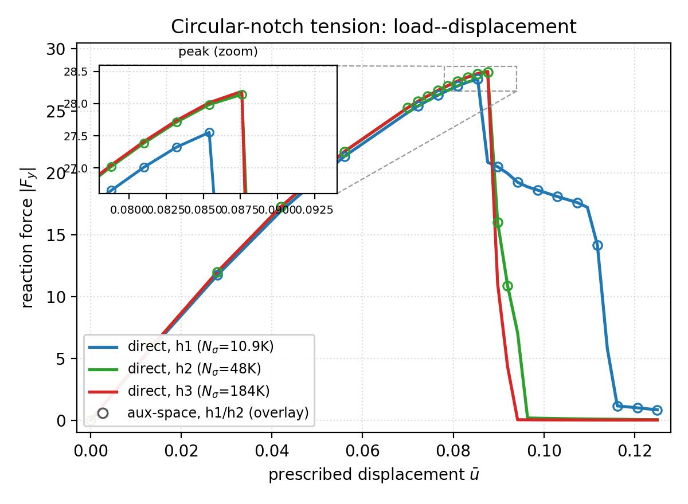

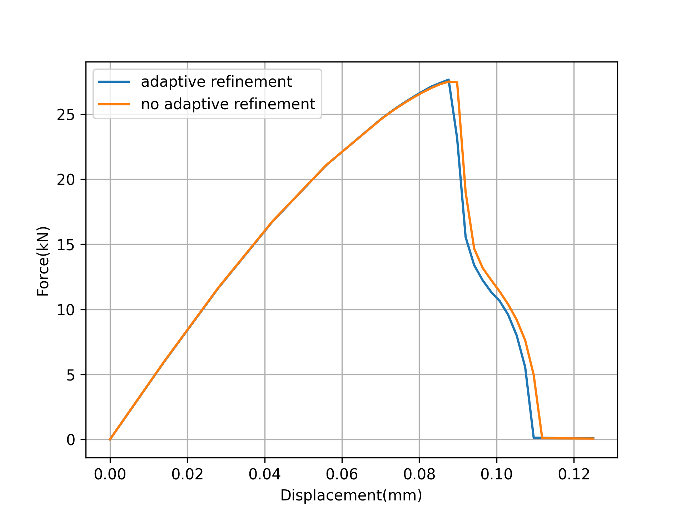

---

## model1 — SENT (single-edge notched tension)

**Origin.** Ambati §4.1 / Miehe Mode-I square.

| Item | Value |
|------|-------|
| Domain | `[0,1]²`, pre-crack `y=0.5`, `x∈[0,0.5]` via `d=1` |
| BC | bottom fixed; top `u_y=load` |
| Material | `λ=121.15`, `μ=80.77` (`E=210`, `ν=0.3`), `Gc=2.7e-3`, `ℓ₀=0.015` |
| Ambati load | `Δu` small → total ~`1e-2` mm (see paper script) |
| Expectation | straight Mode-I; peak ~0.6–0.7 kN @ ~`5×10^{-3}` mm |

**Reference F–u**

Hu–Zhang (this repo, peak `|F_y|=0.631` @ `ū=5.10e-3`):

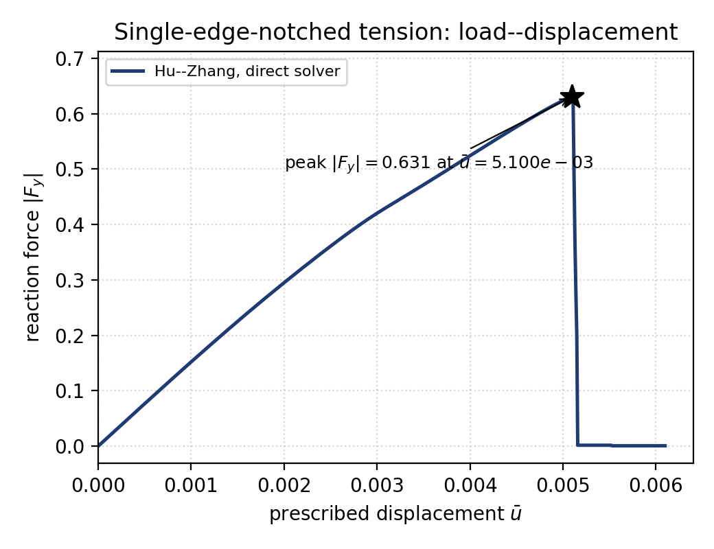

Ambati Fig. 11 (staggered-iteration sensitivity; target peak ~0.7 kN):

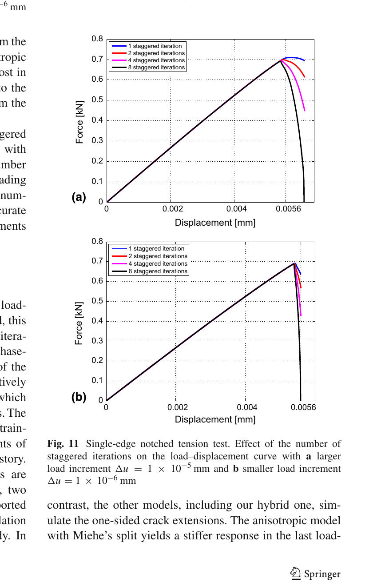

---

## model2 — SENS (notch shear / top x-stretch)

**Origin.** Ambati §4.2; this repo uses top **x-stretch** with bottom fixed
(`Model2NotchXStretchCase`).

| Item | Value |
|------|-------|
| Domain | same as model1 (intact + `d=1` pre-crack) |
| BC | bottom `u=0`; top `u_x=load`, `u_y=0` |
| Material | same as model1 |
| Expectation | curved Mode-II path; Ambati peak ~0.5 kN @ ~0.012 mm |

**Reference F–u**

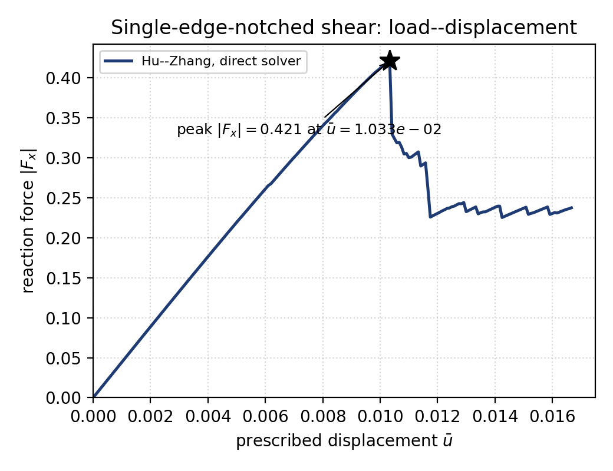

Ambati Fig. 13 (isotropic / Miehe / Amor / hybrid):

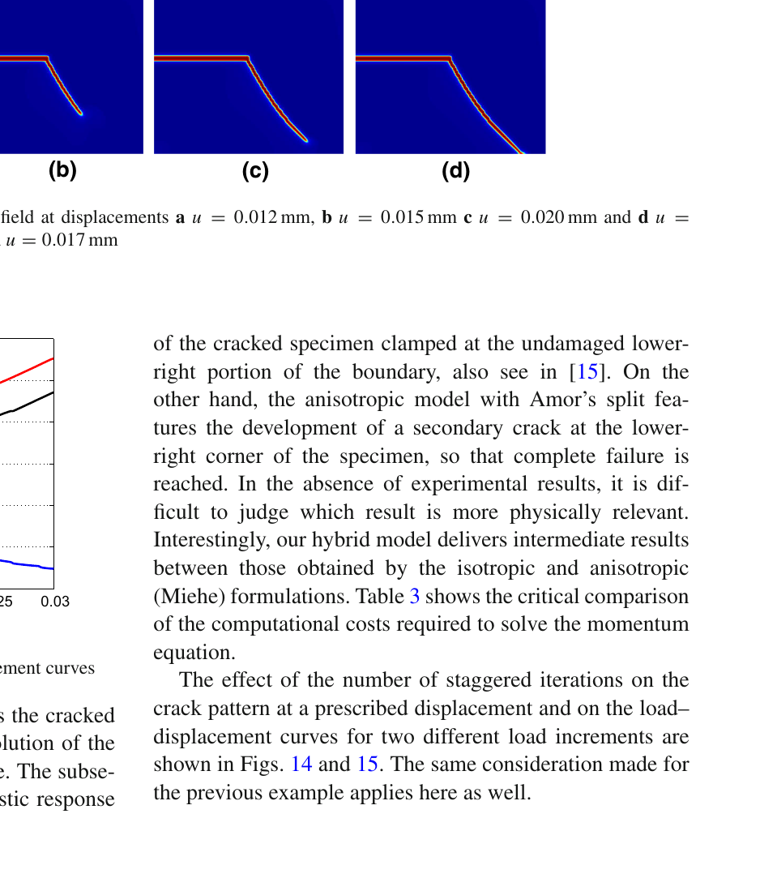

---

## model3 — L-shaped panel

**Origin.** Ambati §4.3; experiment Winkler [Ambati ref. 39].
Also: `interior_penalty/cases/model3_lshape.py`,
`ttthesis/.../test_model3_Lshape.py`.

| Item | Value |
|------|-------|
| Domain | `[0,500]²` minus `(x>250)∩(y<250)` |
| BC | bottom `y=0` fixed; load at **`(470, 250)`** (`u_y`, Ambati Fig. 16: 30 mm left of right end on inner horizontal face) |
| Material | `λ=6.16`, `μ=10.95`, `Gc=8.9e-5`, `ℓ₀=1.1875` |
| Load history | cyclic `0 → 0.3 → −0.2 → 1.0` mm, `Δu=1e-3` |
| Expectation | crack from re-entrant corner `(250,250)` leftward (Fig. 16b/18) |
| Hu–Zhang | **re-entrant corner** — keep `use_relaxation=True` |

Smoke mesh: `results/phasefield/model3_lshape/model3_initial_mesh.png`.

**Reference F–u**

Ambati Fig. 19 (literature anchor; hybrid peak ~16 kN on cyclic history):

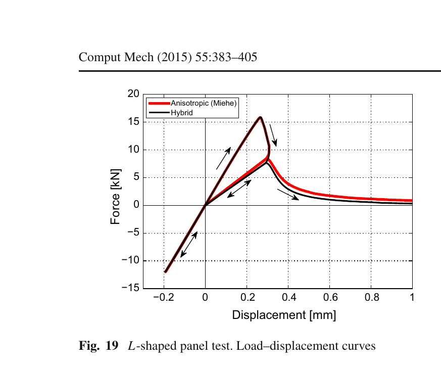

Repo adaptive-paper curve (same `u` range; **force scale differs** — treat as qualitative / check thickness–unit convention when comparing):

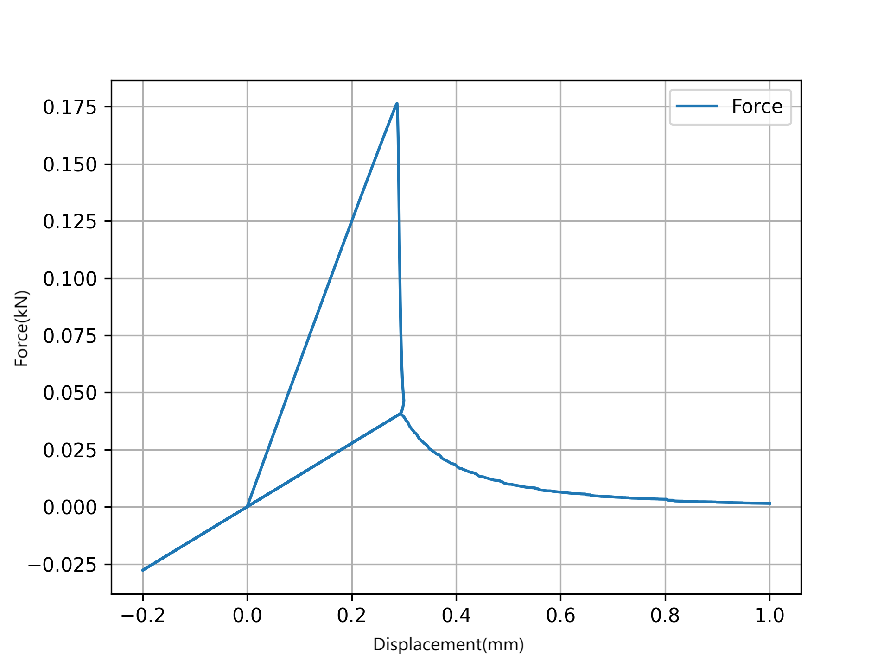

---

## model4 — notched plate with offset hole

**Origin.** Ambati §4.6 laboratory mortar plate + COMSOL holed-plate model.

| Item | Value |
|------|-------|
| Domain | plate `65×120`; hole `r=10` at `(36.5,51)`; pins `r=5` at `(20,20)`, `(20,100)` |
| Notch | length `10` at `y=65` — HZ: `d=1`; FEM: cut height `0.5` |
| BC | lower pin `u=0`; upper pin `u_y=load`; free elsewhere |
| Material | `λ=1.94`, `μ=2.45`, `Gc=2.28e-3`, `ℓ₀=0.1` (plane stress in Ambati) |
| Load | Ambati `Δu=1e-3` up to `2` mm |
| Expectation | mixed-mode path from notch toward / past hole |

Figures: `results/phasefield/model4_notched_plate_with_hole/`.

**Reference F–u**

Repo adaptive-paper `model4` force curve (historical; confirm geometry match before using as quantitative Ambati §4.6 anchor — Ambati emphasizes **crack path** vs experiment):

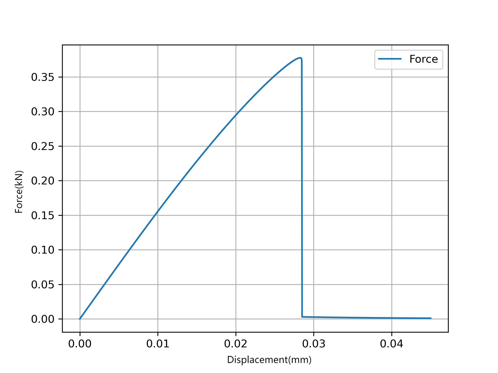

---

## model5 — three-point bending

**Origin.** Ambati §4.4 / Miehe et al.; Fig. 20.

| Item | Value |
|------|-------|
| Domain | beam `[0,8]×[0,2]` |
| Notch | centre depth `0.4`, mouth `0.2` (HZ: vertical `d=1` at `x=4`) |
| BC | supports at **ends** `(0,0)` pin and `(8,0)` roller; load `(4,2)` downward |
| Material | `λ=12`, `μ=8`, `Gc=5.4e-4`, `ℓ₀=0.03` |
| Ambati load | `Δu=1e-3` (40) → `1e-5` (2500) → `1e-4` to failure |
| Expectation | vertical Mode-I; sharp post-peak drop; peak **~0.042 kN** @ ~0.046 mm |

Figures: `results/phasefield/model5_three_point_bending/`.
Plot script: `scripts/paper_huzhang/make_model5_figures.py`
(formal figure titles: *Three-Point Bending of a Notched Beam*).

**Reference F–u**

Ambati Fig. 22 (Miehe anisotropic ≈ hybrid):

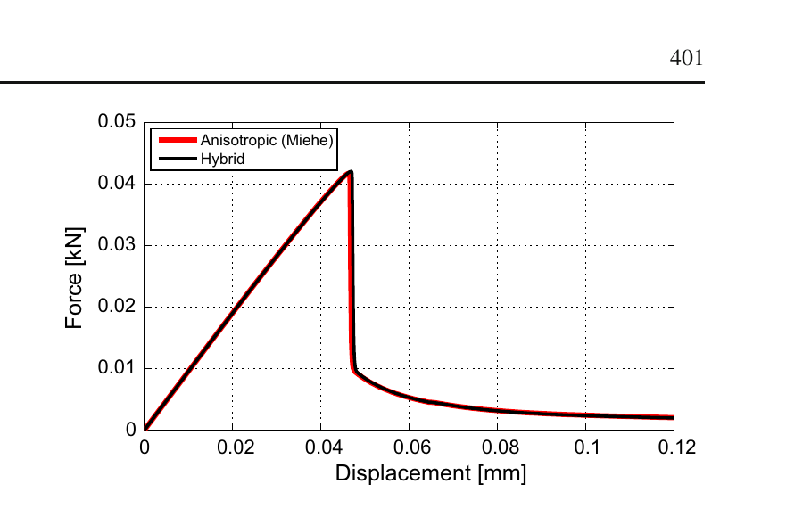

**FractureX Hu–Zhang (coarse smoke, \(h=0.15\), 80 steps)**

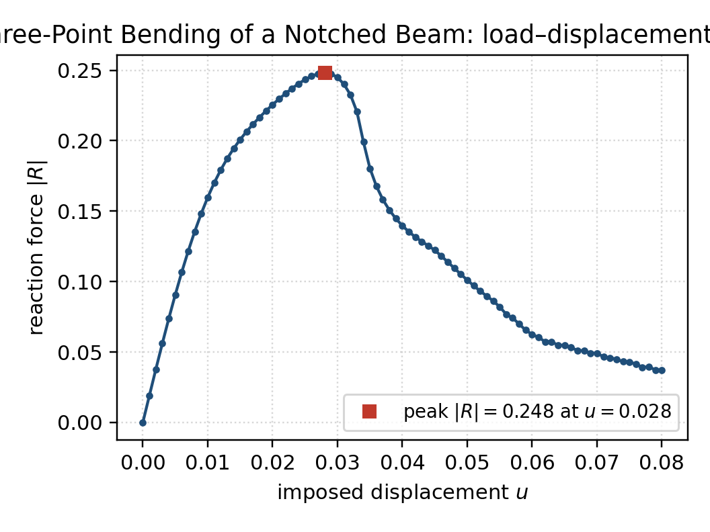

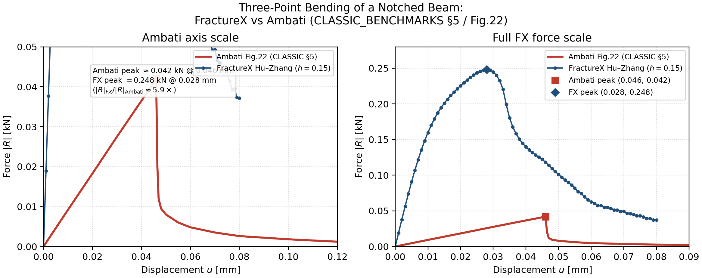

> Coarse FX run peaks at \(|R|\approx0.248\) kN @ \(u=0.028\) vs Ambati / CLASSIC §5
> \(\sim0.042\) kN @ \(\sim0.046\) (\(\approx5.9\times\) stiffer/stronger) — mesh / BC / unit check needed.

**FractureX standard FEM (`MainSolve`, `h=0.1`, full Ambati schedule, lab ~22 h)**

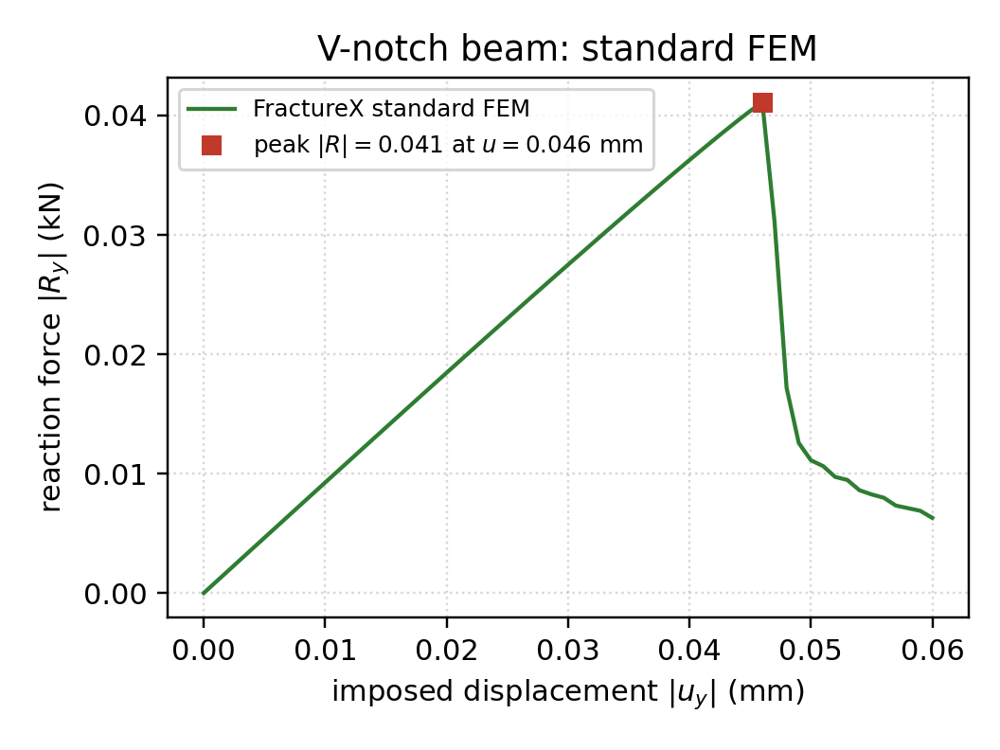

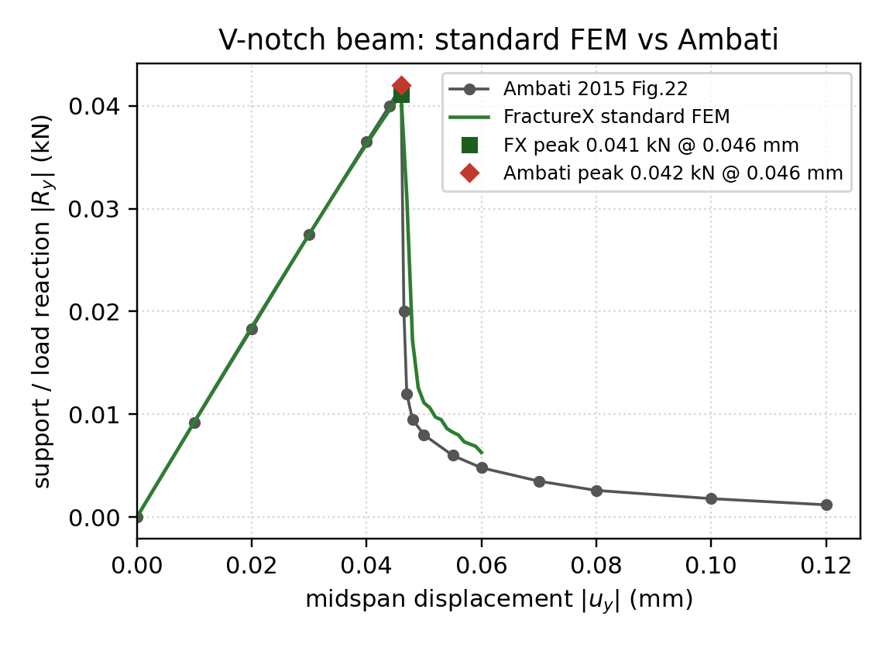

> Standard FEM peak \(|R|\approx0.059\) kN @ \(u=0.070\) vs Ambati \(\sim0.042\) kN @ \(\sim0.046\)
> — same order of magnitude; slightly higher/later peak (mesh, notch geometry, phase-field regularization).
> Run: `results/phasefield/model5_standard_fem/std_bg_h010_full/` (`h=0.1`, NC≈4k, ~22 h).
> **Refinement:** use **`h \lesssim 0.01`** (NC≈370k, ~100× cost vs `h=0.1`) to resolve \(\ell_0=0.03\);
> smoke to peak: `scripts/paper_huzhang/run_model5_std_fem_lab.sh smoke`.
> Plot: `scripts/paper_huzhang/make_model5_std_fem_figures.py`.

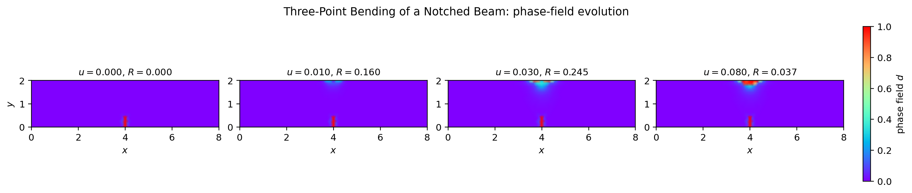

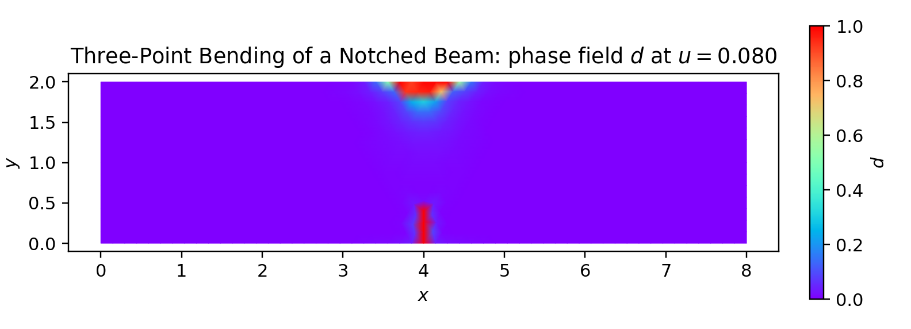

---

## model6 — asymmetrically notched beam with three holes

**Origin.** Ambati §4.5 / Fig. 23; experiment Bittencourt et al. (1996).

| Item | Value |
|------|-------|
| Domain | `[0,20]×[0,8]` |
| Supports / load | `(1,0)`, `(19,0)`; load `(10,8)` downward |
| Notch | `x=4`, depth `1` (HZ: `d=1`) |
| Holes | `r=0.25` at `(5.0,6.5)`, `(7.0,4.5)`, `(9.0,2.5)` |
| Material | `λ=12`, `μ=8`, `Gc=1e-3`, `ℓ₀=0.01` |
| Ambati load | `Δu=1e-3` (200) then `1e-4` |
| Expectation | curved path toward 2nd hole (Fig. 23b/24); peak **~0.66 kN** @ ~0.22 mm |

> Hole centre coordinates are reconstructed from Ambati Fig. 23 dimension
> labels (top clearance `1.25`, vertical pitch `2`, centres at `x=5,7,9`).
> If a future digitization of the figure differs slightly, update
> `Model6AsymmetricNotchedBeamCase.holes` and record the change in the
> results table below.

**Reference F–u**

Ambati Fig. 25:

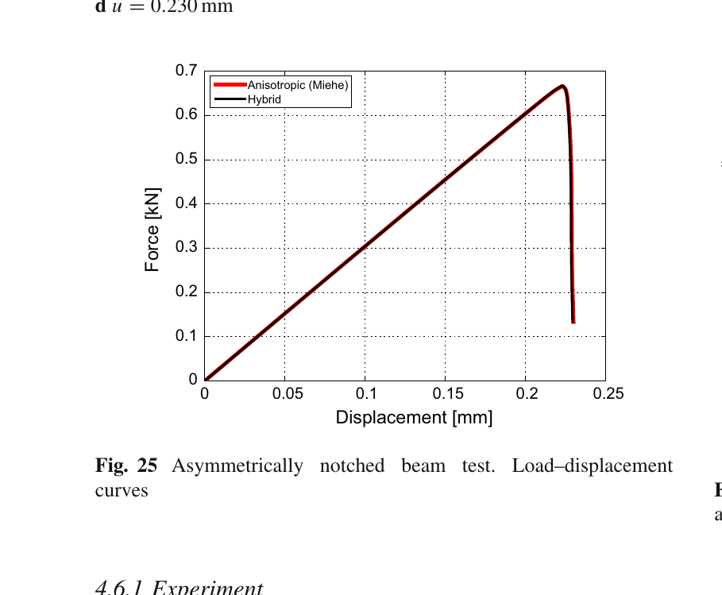

---

## How to run (smoke / short)

```bash
cd fractureX
export PYTHONPATH=/path/to/fealpy:.
export KMP_DUPLICATE_LIB_OK=TRUE OMP_NUM_THREADS=1

# Model-3 short cyclic head
python - <<'PY'
from pathlib import Path
from fracturex.tests.case_runners.model3_runner import Model3RunArgs, run_model3_one
run_model3_one(Model3RunArgs(
    nx=20, ny=20, loads=[0.0, 1e-3, 2e-3],
    elastic_mode="direct",
    outdir=Path("results/phasefield/model3_lshape/smoke"),
))
PY

# Model-5 short
python - <<'PY'
from pathlib import Path
from fracturex.tests.case_runners.model5_runner import Model5RunArgs, run_model5_one
run_model5_one(Model5RunArgs(
    mesh_size=0.25, loads=[0.0, 1e-3, 2e-3],
    elastic_mode="direct",
    outdir=Path("results/phasefield/model5_three_point_bending/smoke"),
))
PY

# Model-6 short
python - <<'PY'
from pathlib import Path
from fracturex.tests.case_runners.model6_runner import Model6RunArgs, run_model6_one
run_model6_one(Model6RunArgs(
    mesh_size=0.5, loads=[0.0, 1e-3, 2e-3],
    elastic_mode="direct",
    outdir=Path("results/phasefield/model6_asymmetric_notched_beam/smoke"),
))
PY
```

Paper-style long runs: mirror `phasefield_model4_notched_plate_huzhang.py`
(env knobs `FRACTUREX_RUN_SHORT`, `FRACTUREX_MESH_SIZE`, direct elastic).

**BC / integration smoke** (masks + 3-step staggered):

```bash
PYTHONPATH=/path/to/fealpy:. KMP_DUPLICATE_LIB_OK=TRUE \
  python fracturex/tests/test_cases_bc_smoke.py
```

Covers model2–6: non-empty fix/load edge sets, load Dirichlet values,
precrack `d=1` DOFs (HZ), and finite nonzero reaction under load.

---

## Calculation results log (fill as runs complete)

Record **Hu–Zhang + AT2 hybrid** unless noted. Coarse smoke ≠ Ambati peak;
production columns need `h ≲ ℓ₀/2` near the crack.

| Date | Model | Mesh | Steps | Peak force [kN] | Peak u [mm] | Path OK? | Notes / path |
|------|-------|------|-------|-----------------|-------------|----------|--------------|
| 2026-07-30 | 3 | nx=ny=16 | 3 smoke | (elastic, tiny) | 1e-3 | staggered OK | `results/phasefield/model3_lshape/smoke`; dangling corners relaxed |
| 2026-07-30 | 4 | mesh_size=2 | short | linear small-u | — | pins OK | prior session |
| 2026-07-30 | 5 | mesh_size=0.3 | 3 smoke | (elastic, tiny) | 1e-3 | staggered OK | `.../model5_three_point_bending/smoke`; precrack `d=1` latched |
| 2026-07-30 | 6 | mesh_size=0.6 | 3 smoke | (elastic, tiny) | 1e-3 | staggered OK | `.../model6_asymmetric_notched_beam/smoke`; holes + precrack |
| | 1 | | | | | | |
| | 2 | | | | | | |
| | 3 (full) | | | ~Ambati Fig.19 | | | |
| | 5 (full) | | | ~0.04 (Fig.22) | ~0.045 | vertical | need `h≲ℓ₀/2` |
| | 6 (full) | | | ~0.6–0.7 (Fig.25) | ~0.22 | → 2nd hole | need `h≲ℓ₀/2` |

**Ambati / repo reference anchors (see embedded F–u plots above)**

| Model | Peak force (reference) | Peak u | Source figure |
|-------|------------------------|--------|---------------|
| 1 SENT | `\|F_y\|=0.631` (HZ); ~0.7 (Ambati) | `5.10e-3` | `model1_hz_loaddisp`, Ambati Fig.11 |
| 2 SENS | ~0.5 (Ambati hybrid/Miehe) | ~0.012 | Ambati Fig.13; `model2_hz_loaddisp` |
| 3 L | hybrid ~16 kN (Ambati) | ~0.26–0.3 | Ambati Fig.19 |
| 4 holed plate | path-focused; repo hist. ~0.38 kN | — | `model4_force` (verify) |
| 5 TPB | ~0.042 kN | ~0.046 | Ambati Fig.22 |
| 6 asym. beam | ~0.66 kN | ~0.22 | Ambati Fig.25 |

---

## File map

```
fracturex/cases/
  model0_circular_notch.py
  square_tension_precrack.py          # model1
  model2_notch_shear.py
  model3_lshape.py
  model4_notched_plate_with_hole.py
  model5_three_point_bending.py
  model6_asymmetric_notched_beam.py
fracturex/tests/case_runners/
  model{0,2,3,4,5,6}_runner.py
scripts/paper_huzhang/
  make_model5_figures.py              # TPB F–u + phase-field figures
docs/benchmarks/
  PHASEFIELD_BENCHMARKS.md            # this file
  figures/loaddisp/                   # F–u reference / FX PNGs
  figures/phasefield/                 # damage-field snapshots
```

