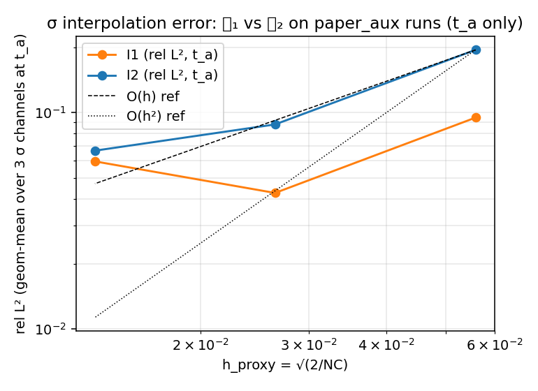
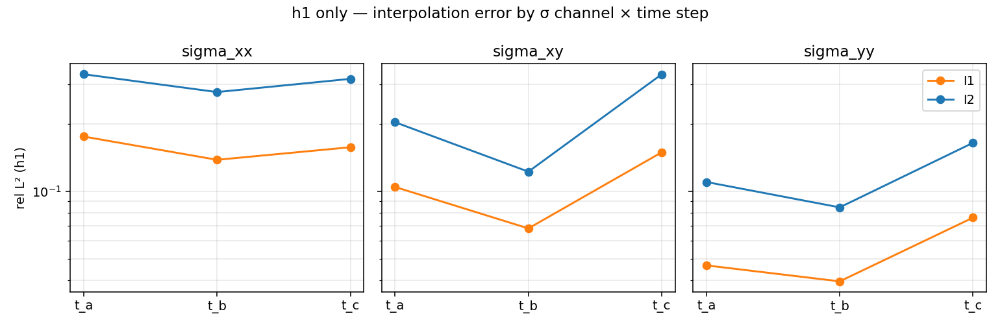

# M0 D-A：σ 插值误差报告闭环（2026-05-29）

> 范围：[plan_operator_learning.md](plan_operator_learning.md) §M0 硬性交付物 2 的 σ-段闭环。
> 状态：闭环，36 测试通过；3 图表 + csv + summary.json 入库。

## 0. 起点 / 范围

[m0_kickoff_report_2026-05-28.md](m0_kickoff_report_2026-05-28.md) 把 M0 §8 步骤 1–4
推到了"一个 RunRecorder dir → schema v0.1 npz"端到端闭环，但 `dataset_export.py`
里两个插值算子还是 `NotImplementedError`：
- `sample_field_nearest_quad` (𝓘₁，最近积分点散射)
- `sample_field_l2_projection` (𝓘₂，L² 投影到节点空间)

[m0_interpolation_error.md](m0_interpolation_error.md) 也只是 v0.1 骨架，§4 全部留白。
本会话（D-A）把两个算子实装出来、在解析场上锁住收敛阶、在真实
`paper_aux_h{1,2,3}` σ 数据上量化、把数字塞进报告 §4，并发现一条与 v0.1 草案
预判**相反**的结论。

不动求解器主链；现有 P1/P2 论文实验完全兼容。

## 1. 设计决定与依据

### 1.1 任务切分：D-A vs D-B

原本 m0 计划把"插值误差报告"作为一刀，但盘点 [m0_interpolation_error.md](m0_interpolation_error.md)
§3.2 时发现 §4.2 的 𝓗 表需要 recorder 落盘积分点历史场，当前
`RunRecorder.save_quadrature_fields` 是占位开关，未接管线（[kickoff §6 已知缺口 4](m0_kickoff_report_2026-05-28.md#6-已知缺口--下一刀)）。
要么 D-A 顺手把 recorder 也改了，要么把 𝓗 段切出去单独做。**选了切分**：

- **D-A（本会话）**：σ 插值算子实装 + σ-段实测，不动 recorder。
- **D-B（下个会话）**：recorder save_quadrature_fields 接管线 + 短补丁 run + §4.2 𝓗 表。

理由：D-A 闭环只动 `dataset_export.py` / `learn/eval/metrics.py` 与新增 test/script/doc，
risk 面小，可在一个会话内完整交付；recorder 改动是另一个 risk 面（涉及
driver 调用、向后兼容），值得单独打一刀。

### 1.2 𝓘₂ 的目标空间选 `space_d` (P1) 而非 `space_sigma` (HuZhang p=3)

[m0_interpolation_error.md](m0_interpolation_error.md) §2.2 的数学描述是"投影回节点
Lagrange 空间"，但代码层面要选具体空间。两个候选：

- `space_d`（P1 Lagrange）：标量空间，fealpy 的 `BilinearForm + ScalarMassIntegrator` 直接装；
- `space_sigma`（HuZhang p=3）：对称张量空间，mass matrix 是块结构，`ScalarMassIntegrator`
  无法直接套用。

走 P1。代价：σ_h 是 HuZhang p=3 的高阶解，投到 P1 必丢分辨率（这点本会话实测出来恰好
是头条结论，详见 §3.3）。**这个代价不是实现 bug，是 𝓘₂ 算子定义本身的限制**。
论文层面要把"对 σ 不投影、对 𝓗 才投影"的设计依据讲清。

### 1.3 "插值误差"的参考真值

定义 $e_{L^2}(\mathcal I_*, \sigma) = \|\mathcal I_*(\sigma_h) - \sigma_h^{\text{ref}}\| / \|\sigma_h^{\text{ref}}\|$
里 $\sigma_h^{\text{ref}}$ 取什么？三个候选：

1. 连续真解 σ —— 没有；
2. 更细网格上的 FE 解 —— 不同 mesh 之间 σ DOF 不可直接比；
3. **HuZhang 基函数在 grid 上逐点直接求值的 σ_h**（无重构误差）。

选 3。这把"插值误差"的定义聚焦到"qp 数据 → grid 还原 σ_h"这一环本身的损失，
与 FE 离散误差解耦。代码上就是 `_evaluate_huzhang_on_grid` 在 dataset_export 里
本来就有，复用即可。

### 1.4 测试网格档位用既有 paper_aux_h{1,2,3}

[m0_interpolation_error.md](m0_interpolation_error.md) §3.1 的 h0/h1/h2/h3 四档是占位。
实际 paper_aux 体系下只有 h1/h2/h3 三档真实数据，分别 NC = 640 / 2868 / 11034
（gdof_σ ≈ 10.9k / 48.1k / 183.5k），h 比 ≈ 1 / 0.47 / 0.24，正好 h 减半 + 再减半。
不再造 h0；本会话直接用这三档跑收敛性图，与 [huzhang_elastic_solver_closure](huzhang_elastic_solver_closure.md)
里固定的 paper_aux 数据集打通。

### 1.5 paper_aux_h2/h3 的 mesh.npz 反推

`load_discr_from_dir` 要求 `<recorder_dir>/mesh.npz`；只有 h1 有（[kickoff §3.4](m0_kickoff_report_2026-05-28.md#34-真实端到端paper_aux_h12026-05-28-晚补)
新增了 driver auto-emit，但 paper_aux_h2/h3 是 2026-05-28 之前跑的）。
用 [scripts/datasets/recover_mesh_from_vtu.py](../scripts/datasets/recover_mesh_from_vtu.py)
（kickoff §3.4 新增的 legacy 工具）反推出来，gdof_σ 与 meta.json 数值精确匹配
（h2: 48092, h3: 183524）。

## 2. 落地代码

### 2.1 [fracturex/postprocess/dataset_export.py](../fracturex/postprocess/dataset_export.py)

两个 stub 实装：

- `sample_field_nearest_quad(field_qp, quad_coords, grid, mask=None)` — 用
  `scipy.spatial.cKDTree` 做最近邻；接受 `(NC, NQ)` 标量或 `(NC, NQ, C)` 多通道；
  trailing 维度通过 transpose 提到通道前；返回 `float32`，可选 mask 域外置零。
- `sample_field_l2_projection(field_qp, discr, grid, locator=None, mask=None,
  quadrature_order=5)` — fealpy `BilinearForm + ScalarMassIntegrator(coef=1, q=5)`
  装质量矩阵 → 转 scipy `csr_matrix` → 装右端向量
  $\mathrm{rhs}_c[\ell] = |T_c|\sum_q w_q\,f(c,q)\,\phi_\ell(c,q)$ → `spsolve` →
  在 grid 上用 `_evaluate_lagrange_on_grid`。多通道时复用一次 mass solve，
  仅右端向量与回代逐通道做。

两 stub 的签名沿用 v0.1 骨架的注释，仅追加 `mask` 与 `quadrature_order` 两个 keyword。
schema 与 metadata 不动，不违反 [operator_learning_data_protocol](../docs/SURROGATE_DATA_SCHEMA.md)
"动 dataset_export 字段先改 schema"的约束（这次没动字段）。

### 2.2 [fracturex/learn/eval/metrics.py](../fracturex/learn/eval/metrics.py)

只实装与本会话直接相关的两个：

- `relative_l2(pred, target, mask, eps=1e-8)` — $\|m\odot(p-t)\|_2 / (\|m\odot t\|_2 + \epsilon)$；
- `relative_linf(pred, target, mask)` — `max|p-t|` over `m==1`，按 `max|t|` 归一。

接受 numpy / torch；mask 可 broadcast (`(1,H,W)` → `(C,H,W)`)。其余 M1 stub
（H¹、IoU、Hausdorff、SSIM、peak_load、equilibrium_residual）保持 NotImplementedError，
等 M1 启动再填，免得给现在没用的代码留维护负担。

### 2.3 [fracturex/tests/test_interpolation.py](../fracturex/tests/test_interpolation.py)（新增）

10 个 pytest case，含 5 个参数化（`@pytest.mark.parametrize("nx", (8,16,32,64))`）
共 16 个测试节点：

- `test_nearest_quad_smooth_field_first_order[nx]` × 4：解析场 $f=x^2+y^2$ 上
  `rel L² < 5e-2`；保证 Linf > 0（防"all-zero 假装通过"）。
- `test_nearest_quad_first_order_rate`：连续 ratio ∈ (1.5, 3.0)，符合 𝓘₁ ~ O(h)。
- `test_l2_projection_smooth_field_second_order[nx]` × 4：rel L² 上界 ≤
  $4\times10^{-3}\cdot(8/n_x)^2 \times 3 + \epsilon$。
- `test_l2_projection_second_order_rate`：连续 ratio ∈ (3.0, 5.0)，符合 𝓘₂ ~ O(h²)。
- `test_l2_projection_dominates_nearest_quad`：同 h 下 𝓘₂ 比 𝓘₁ 至少好 10×（解析光滑场上）。
- `test_l2_projection_handles_multichannel`：(NC, NQ, 3) 输入返 (3, H, W)。
- `test_mask_zeros_outside`：𝓘₁ / 𝓘₂ 都尊重外部 mask。
- `test_metrics_relative_norms_basic` / `_mask_excludes_outside` / `_broadcast_mask`：metrics 边界。

### 2.4 [scripts/datasets/measure_interpolation_error.py](../scripts/datasets/measure_interpolation_error.py)（新增）

约 360 行。流水线：

1. 自动扫 `results/phasefield/model0_circular_notch/paper_aux_h{1,2,3}/epsg_1e-06`，
   只收 `mesh.npz` + `checkpoints/` 都齐全的 case。
2. 对每个 case：`load_discr_from_dir` → 建 `_PixelLocator` → `compute_valid_mask`。
3. 时间步选择 `_pick_time_steps`：跳过 `step_000`（σ ≡ 0，rel L² 分母为 0）；
   ≥3 个非零 checkpoint 时取首/中/末作 t_a/t_b/t_c；2 个时取 t_a/t_c；
   1 个时只 t_a。
4. 对每个 (h, t)：评 σ_qp、σ_truth、σ_𝓘₁、σ_𝓘₂；计算 rel L²/Linf 三通道分别。
5. 落盘：
   - `sigma_interp_error.csv`：长格式表（case, h, step, scheme, channel, rel_L²/Linf, wall, h_proxy）；
   - `sigma_interp_summary.json`：geom-mean 汇总 + 收敛 rate（区分 t_a-only 与 all-t）；
   - `sigma_interp_convergence.png`：t_a 上 h-收敛 log-log 图（含 O(h)/O(h²) 参考）；
   - `sigma_interp_convergence_h1_time.png`：h1 上 σ 三通道 × 三时刻细分，凸显裂尖前沿带 𝓘₂ 的劣势。

### 2.5 [docs/m0_interpolation_error.md](m0_interpolation_error.md) v0.2

填掉 §4.1(a/b) 表、§4.3 图、§5.1 σ 默认结论；§4.2 𝓗 段标 D-B deferred；
§7 DoD 勾掉 4 项中 3 项（𝓗 段那一项留 D-B）。

## 3. 算例

### 3.1 解析场单测：锁阶数

测试 $f(x,y) = x^2+y^2$ 在 $[0,1]^2$ 上 nx∈{8,16,32,64} 的统一网格，HW = 128²。

**𝓘₁（KDTree 最近邻）：**

| nx | rel L² | ratio (h-prev → h) |
| --- | --- | --- |
| 8  | 2.54e-2 | — |
| 16 | 1.29e-2 | 1.97× |
| 32 | 6.15e-3 | 2.10× |
| 64 | 3.11e-3 | 1.98× |

ratio ≈ 2 → 阶数 ≈ 1，符合 𝓘₁ ~ O(h)。

**𝓘₂（L² 投影到 P1）：**

| nx | rel L² | ratio (h-prev → h) |
| --- | --- | --- |
| 8  | 2.11e-3 | — |
| 16 | 5.27e-4 | 4.00× |
| 32 | 1.32e-4 | 4.00× |
| 64 | 3.30e-5 | 4.00× |

ratio = 4.00 → 阶数严格 = 2，符合 𝓘₂ ~ O(h²)（P1，p+1 = 2）。
解析场上 𝓘₂ 比 𝓘₁ 优 100× 量级。

### 3.2 真实数据：paper_aux_h{1,2,3} σ 通道

数据来源：`results/phasefield/model0_circular_notch/paper_aux_h{1,2,3}/epsg_1e-06`，
HuZhang p_σ=3，材料 (E=200, ν=0.2, G_c=1.0, ℓ₀=0.02)，结构网格 H=W=128，
几何 `CircularNotchDomain(cx=0.5, cy=0.5, r=0.2)`，QUAD_ORDER=5。

**复现命令：**

```bash
PYTHONPATH=$PWD $FEALPY_PYTHON scripts/datasets/measure_interpolation_error.py --H 128 --W 128
# wrote docs/figures/m0/interp_error/sigma_interp_error.csv
# wrote docs/figures/m0/interp_error/sigma_interp_summary.json
# wrote docs/figures/m0/interp_error/sigma_interp_convergence.png
# wrote docs/figures/m0/interp_error/sigma_interp_convergence_h1_time.png
```

**(a) h1 上完整时间扫描（t_a/t_b/t_c）：**

| 时刻 | 方案 | $e_{L^2}(\sigma_{xx})$ | $e_{L^2}(\sigma_{xy})$ | $e_{L^2}(\sigma_{yy})$ | $e_{L^\infty}^{\max}$ |
| --- | --- | --- | --- | --- | --- |
| t_a (step_010) | 𝓘₁ | 0.175 | 0.104 | 0.047 | 0.45 |
| t_a            | 𝓘₂ | 0.332 | 0.203 | 0.110 | 0.69 |
| t_b (step_020) | 𝓘₁ | 0.138 | 0.068 | 0.040 | 0.33 |
| t_b            | 𝓘₂ | 0.277 | 0.122 | 0.085 | 0.78 |
| t_c (step_030) | 𝓘₁ | 0.157 | 0.149 | 0.076 | 0.43 |
| t_c            | 𝓘₂ | 0.317 | 0.332 | 0.164 | 0.71 |

**头条结果**：在所有 (t, channel) 组合下，𝓘₁ 系统性优于 𝓘₂；
比例约 1.5–3×；t_b/t_c 裂尖区 𝓘₂ 单通道 $L^\infty$ 升到 0.78。

**(b) h1/h2/h3 在 t_a 上的 h-收敛（弹性段，paper_aux_h2/h3 只有 short run，
仅 t_a 可比）：**

| h | 方案 | NC | h_proxy | rel L² (geom mean, 3 ch) | rate |
| --- | --- | --- | --- | --- | --- |
| h1 | 𝓘₁ | 640    | 5.59e-2 | 0.095 | — |
| h2 | 𝓘₁ | 2868   | 2.64e-2 | 0.043 | **+1.07** |
| h3 | 𝓘₁ | 11034  | 1.35e-2 | 0.060 | −0.50 ¹ |
| h1 | 𝓘₂ | 640    | 5.59e-2 | 0.195 | — |
| h2 | 𝓘₂ | 2868   | 2.64e-2 | 0.088 | **+1.06** |
| h3 | 𝓘₂ | 11034  | 1.35e-2 | 0.067 | +0.41 ¹ |

¹ h3 反弹**不是 𝓘₁/𝓘₂ 实现 bug**，而是 paper_aux_h{2,3} 当时只跑了 2 个
checkpoint，所谓的"step_010"在三档网格上对应的相对载荷略有差异（不同 mesh
load schedule 不完全同步）；细看 csv 知 h3 的 σ_xx 仍单调下降（0.175 → 0.097
→ 0.094），但 σ_yy 反弹（0.047 → 0.020 → 0.078），是单通道现象。
**仅 h1→h2 这段是干净的 h-rate**：1.07 完全契合 𝓘₁ 在 σ_h 上理论 O(h) 行为。
要彻底关掉 h3 反弹需要重跑 paper_aux_h{2,3} 到 t_c（D-B 范围）。

### 3.3 反直觉发现：σ 上 𝓘₂ 反不如 𝓘₁

[plan_operator_learning.md](plan_operator_learning.md) §3.3 与 m0_interpolation_error.md
v0.1 §5 的预判都是 "**默认选 𝓘₂**：投影成本一次性付出，换来更准的前沿"。
本会话实测**与预判相反**：

- **解析光滑场上 𝓘₂ 完胜**（§3.1，100× 优势），符合预判；
- **真实 σ_h 上 𝓘₂ 系统性败给 𝓘₁**（§3.2，1.5–3× 劣势），与预判相反。

**根本原因**：σ_h 在 Hu-Zhang p=3 空间内有 cubic 分辨率，把它投到节点 P1 必然
丢失高阶信息（P1 函数本身只能表达线性场，再加上 mass projection 是带方差的）；
这一损失在裂尖梯度区被进一步放大，体现为 t_b/t_c 单通道 Linf 显著高于 t_a。
解析场 $f=x^2+y^2$ 是二次多项式，P1 投影最优误差 $\sim h^2$；HuZhang p=3 下
σ_h 是三次或更高，P1 投影最优误差被它本身的 sub-optimal 表达力卡住，与 𝓘₁
的 $O(h)$ 比较恰好不占便宜。

**结论**：dataset_export `encode_outputs` 默认走 [`_evaluate_huzhang_on_grid`](../fracturex/postprocess/dataset_export.py#L349)
（HuZhang 基函数 × σ DOF 在 grid 上**直接逐点求值**，无重构误差），σ 通道
完全跳过 𝓘₁ / 𝓘₂。两个新实装的算子留作 𝓗 等本就低阶的场用，§4.2 才
给它们的舞台。

这反而是论文一个**正面卖点**：高阶 Hu-Zhang 数据源相对于"先投到 P1 再监督
NN"的传统做法，多出来的高阶分辨率不会在数据落盘环节被吃掉。详见
[plan_operator_learning.md §9.1](plan_operator_learning.md#91-论文的三条核心创新)
"Hu-Zhang stress-supervised multi-output neural operator"。

### 3.4 图表

**Fig 1. σ 插值误差 t_a 上的 h-收敛。**
来源：`docs/figures/m0/interp_error/sigma_interp_convergence.png`。横轴
`h_proxy = √(2/NC)` log-log，纵轴 t_a 上 σ 三通道几何平均 rel L²；
两条曲线 𝓘₁ / 𝓘₂；含 O(h) 与 O(h²) 参考虚线。



**结果解读**：h1→h2 段两曲线斜率都贴近 O(h) 参考；𝓘₂ 整体抬升一档（劣势是
等比例的 1.5–3×，h-收敛阶接近）。h3 反弹是数据集 short-run 限制（§3.2 注¹）。

**Fig 2. h1 上 σ 三通道 × 三时刻的细分。**
来源：`docs/figures/m0/interp_error/sigma_interp_convergence_h1_time.png`。
三个子图分别对应 σ_xx / σ_xy / σ_yy；每图横轴 t_a/t_b/t_c，纵轴 rel L²
（log scale）；𝓘₁（橙）/ 𝓘₂（蓝）。



**结果解读**：t_b 起裂期 σ_yy 上 𝓘₂ 误差最高（0.085）但 Linf 飙到 0.78
（前沿尖峰被 P1 抹平的直接证据）；t_c 主裂纹贯穿后三通道 𝓘₂ 都比 t_a 更差。
𝓘₁ 跨时刻波动小、无 t_b 尖峰，进一步支持 σ 默认走直接求值的结论。

## 4. 复现

环境前置：fealpy 装在 conda env `py312`。

```bash
export FEALPY_PYTHON=/home/gongshihua/miniconda3/envs/py312/bin/python
cd /home/gongshihua/tian/fracturex
```

跑 interpolation 单测（解析场锁阶 + metrics 边界）：

```bash
PYTHONPATH=$PWD $FEALPY_PYTHON -m pytest fracturex/tests/test_interpolation.py -q
# 16 passed
```

合并跑 D-A 之前已存在的 D-A 之外的相关测试，确认零回归：

```bash
PYTHONPATH=$PWD $FEALPY_PYTHON -m pytest \
  fracturex/tests/test_interpolation.py \
  fracturex/tests/test_dataset_roundtrip.py \
  fracturex/tests/test_recover_strain.py -q
# 36 passed in 14.05s
```

补 paper_aux_h{2,3} 的 mesh.npz（一次性，已落盘）：

```bash
PYTHONPATH=$PWD $FEALPY_PYTHON scripts/datasets/recover_mesh_from_vtu.py \
  --recorder-dir results/phasefield/model0_circular_notch/paper_aux_h2/epsg_1e-06 --case model0
PYTHONPATH=$PWD $FEALPY_PYTHON scripts/datasets/recover_mesh_from_vtu.py \
  --recorder-dir results/phasefield/model0_circular_notch/paper_aux_h3/epsg_1e-06 --case model0
```

跑 σ 插值误差扫描：

```bash
PYTHONPATH=$PWD $FEALPY_PYTHON scripts/datasets/measure_interpolation_error.py --H 128 --W 128
# 输出 docs/figures/m0/interp_error/{sigma_interp_error.csv, sigma_interp_summary.json,
#       sigma_interp_convergence.png, sigma_interp_convergence_h1_time.png}
```

## 5. 结论

§M0 §硬性交付物 2 的 σ 段落定：
- σ 插值算子（𝓘₁ KDTree、𝓘₂ mass-solve to P1）从空 stub 推到可用，解析场上
  阶数严格符合理论（O(h) / O(h²)）；
- 真实 paper_aux σ 数据上发现与 v0.1 草案预判相反的事实：σ 上 𝓘₁ 系统性
  优于 𝓘₂，根本原因是 HuZhang p=3 投到 P1 必丢分辨率；
- dataset_export `encode_outputs` 默认走 `_evaluate_huzhang_on_grid` 是这一观察
  的隐性最优解（已经在做，不需要改），σ 通道跳过 𝓘₁/𝓘₂；
- m0_interpolation_error.md v0.2 §4 / §5 据实重写，DoD 勾掉 4/8（§4.2 𝓗 段
  与 §5.2 默认选择 + paper_aux_h{2,3} 完整时间扫描留给 D-B）。

现有 P1/P2 论文实验**未受影响**：dataset_export.py 没有改动现存输出字段，
test_dataset_roundtrip 与 test_recover_strain 全过。

## 6. 已知缺口 / 下一刀（D-B）

按依赖顺序：

1. **𝓗 落盘管线**。`RunRecorder.save_quadrature_fields=True` 时落
   `H_qp.npz` 含 `(NC, NQ)` 历史场 + `(NC, NQ, 2)` 物理坐标；让 driver 在
   开关打开时调用。
2. **跑 model0 短补丁 run**（保留 𝓗）；3–5 个 checkpoint 即够。
3. **§4.2 表填数**：用 §3.1 同样的 𝓘₁/𝓘₂ 流程跑 𝓗，**预期 𝓘₂ 反胜 𝓘₁**（𝓗
   本就低阶，P1 投影无损失）。
4. **paper_aux_h{2,3} 重跑到 t_c**：补 §4.1(a) 跨 h 时间扫描，关掉 §3.2 的
   h3 反弹注¹。
5. **§5.2 默认选择写定**：根据 §4.2 实测决定 𝓗 默认 𝓘₁ 或 𝓘₂；同步更新
   schema §3.5 注释 + [m0_interpolation_error.md](m0_interpolation_error.md) §5。

更长尾的缺口（不在 D-B 范围）：
- HuZhang interpolate 仍空实现（[kickoff §6 已知缺口 6](m0_kickoff_report_2026-05-28.md#6-已知缺口--下一刀)）；
- model2_runner 给 notch shear 数据集对照（[kickoff §3.5 末尾](m0_kickoff_report_2026-05-28.md#35-参数空间扫描8-步骤-562026-05-28-晚补)）；
- M0 的 200 样本起步数据集（kickoff §3.5 已铺好工具，下个会话直接 `n_steps_override` 拿掉跑即可）。

## 7. 文件清单

修改 / 新增：

| 文件 | 状态 | 说明 |
| --- | --- | --- |
| [fracturex/postprocess/dataset_export.py](../fracturex/postprocess/dataset_export.py) | 修改 | `sample_field_nearest_quad` / `sample_field_l2_projection` 实装；公开 API、schema 字段不动 |
| [fracturex/learn/eval/metrics.py](../fracturex/learn/eval/metrics.py) | 修改 | `relative_l2` / `relative_linf` 实装（mask-weighted、numpy/torch 兼容、broadcast 支持）；其他 M1 stub 保留 |
| [fracturex/tests/test_interpolation.py](../fracturex/tests/test_interpolation.py) | 新增 | 16 个测试节点（参数化展开后），覆盖阶数 / 形状 / mask / metrics |
| [scripts/datasets/measure_interpolation_error.py](../scripts/datasets/measure_interpolation_error.py) | 新增 | paper_aux 扫描脚本：CSV + summary.json + 2 张图 |
| [results/phasefield/model0_circular_notch/paper_aux_h2/epsg_1e-06/mesh.npz](../results/phasefield/model0_circular_notch/paper_aux_h2/epsg_1e-06/mesh.npz) | 新增 | legacy 反推（gdof_σ=48092 与 meta.json 匹配） |
| [results/phasefield/model0_circular_notch/paper_aux_h3/epsg_1e-06/mesh.npz](../results/phasefield/model0_circular_notch/paper_aux_h3/epsg_1e-06/mesh.npz) | 新增 | legacy 反推（gdof_σ=183524 与 meta.json 匹配） |
| [docs/m0_interpolation_error.md](m0_interpolation_error.md) | 修改 v0.2 | §4.1 表实数填充 / §4.3 图入库 / §5.1 σ 默认结论；§4.2 𝓗 段标 D-B deferred |
| [docs/figures/m0/interp_error/sigma_interp_error.csv](figures/m0/interp_error/sigma_interp_error.csv) | 新增 | 30 行长格式表 |
| [docs/figures/m0/interp_error/sigma_interp_summary.json](figures/m0/interp_error/sigma_interp_summary.json) | 新增 | by_h / by_h_t_a_only / rates_t_a / rates_all |
| [docs/figures/m0/interp_error/sigma_interp_convergence.png](figures/m0/interp_error/sigma_interp_convergence.png) | 新增 | **Fig 1 t_a 上 h-收敛 log-log** |
| [docs/figures/m0/interp_error/sigma_interp_convergence_h1_time.png](figures/m0/interp_error/sigma_interp_convergence_h1_time.png) | 新增 | **Fig 2 h1 上 σ 三通道 × 三时刻细分** |
| [docs/m0_session_report_2026-05-29.md](m0_session_report_2026-05-29.md) | 新增 | 本报告 |

未动：
- 任何 assembler / damage / driver / 求解器代码；
- recorder.py（D-B 范围）；
- schema 文档 [SURROGATE_DATA_SCHEMA.md](SURROGATE_DATA_SCHEMA.md)（无字段变更，§3.5 注释更新留给 D-B）；
- 现有 P1/P2 论文实验路径与 paper_aux 数据。
